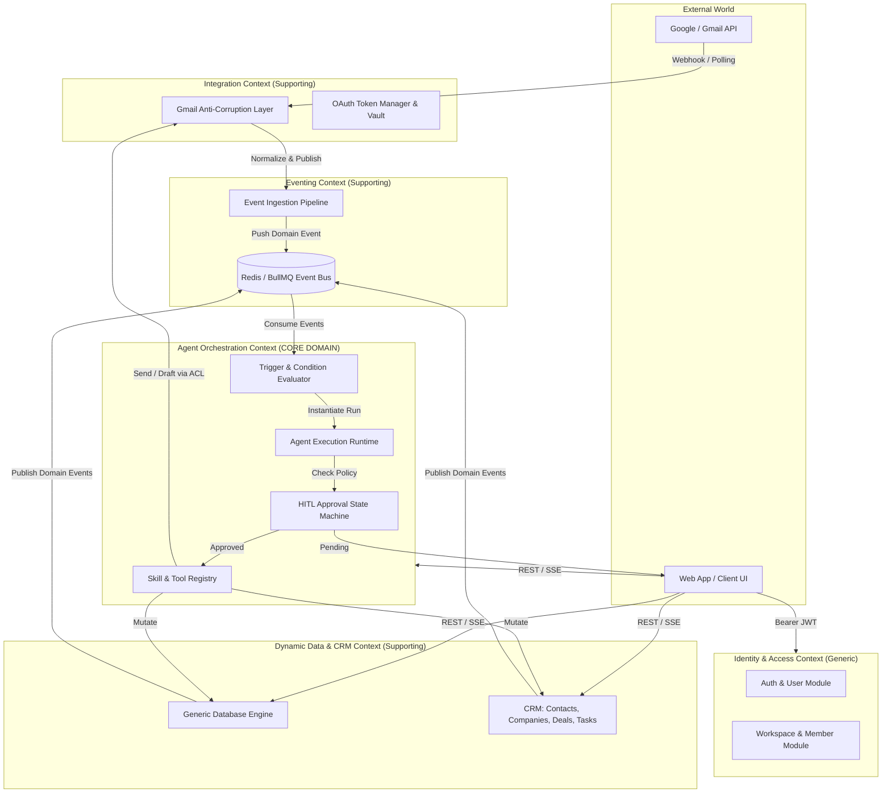
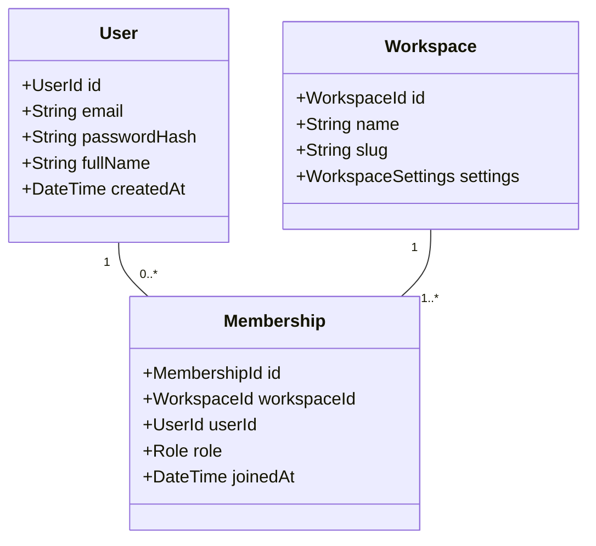
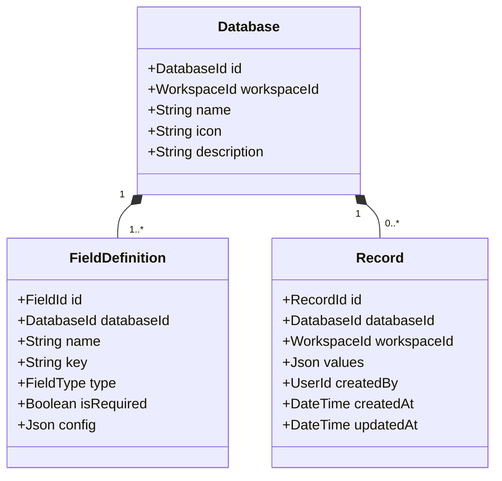
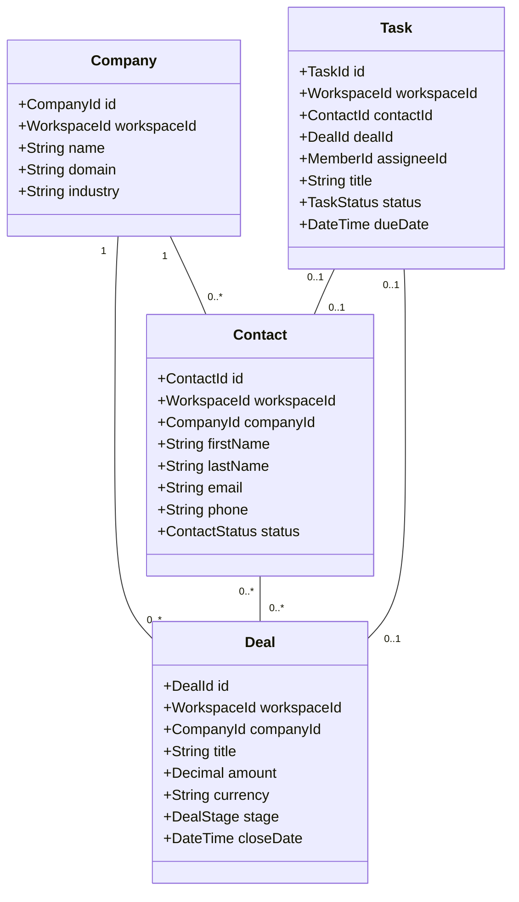
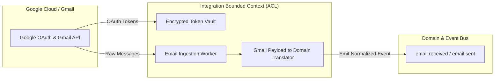
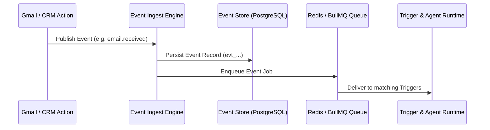
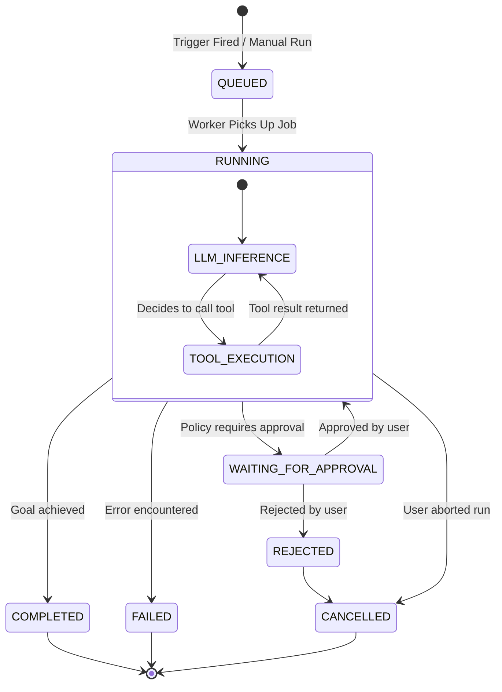
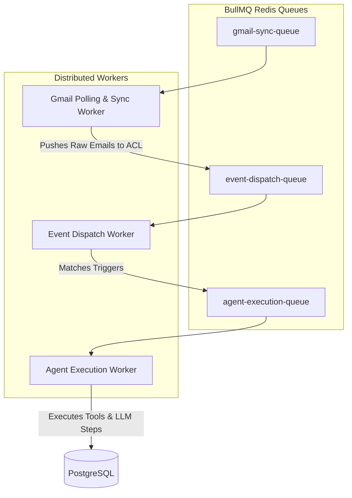

# Brain Workspace API & Product Specification (MVP)

**Version:** 1.0.0-MVP  
**Architecture Style:** Domain-Driven Design (DDD) + Event-Driven Architecture + REST / SSE  
**Backend Framework:** NestJS (Fastify Adapter) + TypeScript + Drizzle ORM + PostgreSQL + BullMQ (Redis)  
**Base URL:** `/api/v1`  

---

# 1. Strategic Design & Subdomain Classification (DDD)

Brain is an **agent-native CRM and dynamic workspace platform** that integrates workspace data (custom databases, CRM contacts, deals, tasks) with external communications (Gmail) and an autonomous, human-in-the-loop agent runtime.

```
+-------------------------------------------------------------------------------+
|                             STRATEGIC DOMAIN MAP                              |
+-------------------------------------------------------------------------------+
|  GENERIC SUBDOMAINS                                                           |
|  - Identity & Access Management (Auth, Users, Workspaces, Memberships, RBAC)  |
+-------------------------------------------------------------------------------+
|  SUPPORTING SUBDOMAINS                                                        |
|  - Dynamic Data Platform (Generic Databases, Custom Fields, Records)          |
|  - CRM Domain Core (Contacts, Companies, Deals, Tasks)                        |
|  - External Integrations & Anti-Corruption Layer (OAuth, Gmail Connector)     |
|  - Event Ingestion & Dispatching (Event Log, Internal Event Bus)              |
+-------------------------------------------------------------------------------+
|  CORE DOMAIN (Primary Differentiator & Business Value)                        |
|  - Autonomous Agent Runtime & Orchestration Engine                            |
|  - Composable Triggers & Condition Evaluator                                  |
|  - Tool & Skill Execution Engine                                              |
|  - Human-in-the-Loop (HITL) Governance & Approval State Machine              |
+-------------------------------------------------------------------------------+
```

---

# 2. Ubiquitous Language

| Term | Context | Definition |
| :--- | :--- | :--- |
| **Workspace** | Identity | The root tenant boundary. All data, members, agents, and integrations belong to a single workspace. |
| **Membership** | Identity | The association between a User and a Workspace, bound by a specific `Role` (`OWNER`, `ADMIN`, `MEMBER`, `GUEST`). |
| **Database** | Dynamic Data | A user-defined relational schema definition containing custom typed fields and tabular records. |
| **Field Definition**| Dynamic Data | A typed attribute within a database (`TEXT`, `NUMBER`, `SELECT`, `RELATION`, `DATE`, etc.) with validation constraints. |
| **Record** | Dynamic Data | An individual row/entity in a Database holding validated attribute-value pairs. |
| **Contact** | CRM | An individual person or correspondent tracked in the workspace CRM pipeline. |
| **Company** | CRM | An organization or account associated with multiple contacts and deals. |
| **Deal** | CRM | A sales opportunity moving through defined pipeline stages with monetary value. |
| **Task** | CRM | An actionable item assigned to a member, optionally linked to a Contact, Deal, or Agent Run. |
| **Integration** | Integration | An authenticated connection to a third-party service (e.g., Google Workspace/Gmail) with OAuth token lifecycle. |
| **Anti-Corruption Layer (ACL)** | Integration | Translation boundary converting vendor-specific payloads (e.g., Gmail API) into clean domain models. |
| **Domain Event** | Eventing | An immutable fact that occurred within a bounded context (`contact.created`, `email.received`). |
| **Agent** | Core Agentic | An autonomous workflow definition with a system prompt, assigned tools (Skills), and an Approval Policy. |
| **Trigger** | Core Agentic | An automated activation rule for an Agent (Event-based or Cron Schedule). |
| **Trigger Condition** | Core Agentic | A predicate evaluated against event payloads to filter whether an Agent Run should be scheduled. |
| **Skill** | Core Agentic | A deterministic capability/tool exposed to the LLM (e.g., `contacts.create`, `mail.create_draft`). |
| **Agent Run** | Core Agentic | A stateful execution instance of an Agent responding to a Trigger or manual invocation. |
| **Run Step** | Core Agentic | An individual execution node within an Agent Run (LLM inference, Tool invocation, Approval wait). |
| **Approval Request**| Core Agentic | A Human-in-the-Loop barrier requiring explicit user sign-off before executing high-risk external actions. |

---

# 3. Context Map & Architectural Blueprint



---

# 4. API Conventions & Cross-Cutting Standards

### 4.1 Base URL & Content Negotiation
- **Base URL:** `/api/v1`
- **Headers:**
  - `Authorization: Bearer <jwt_access_token>`
  - `Content-Type: application/json`
  - `Idempotency-Key: <uuid_v4>` *(Required on mutating POST/PATCH actions)*

### 4.2 Prefixed Domain Identifiers (Type-Safe & Debuggable)
All entity identifiers use unambiguous, URL-safe prefixed ULIDs/UUIDs:

| Prefix | Entity | Example |
| :--- | :--- | :--- |
| `usr_` | User | `usr_01J8A4K...` |
| `ws_` | Workspace | `ws_01J8A4M...` |
| `mbr_` | Workspace Member | `mbr_01J8A4P...` |
| `db_` | Database | `db_01J8A4R...` |
| `fld_` | Database Field | `fld_01J8A4T...` |
| `rec_` | Database Record | `rec_01J8A4V...` |
| `con_` | Contact | `con_01J8A4W...` |
| `cmp_` | Company | `cmp_01J8A4X...` |
| `del_` | Deal | `del_01J8A4Y...` |
| `tsk_` | Task | `tsk_01J8A4Z...` |
| `int_` | Integration Connection | `int_01J8A50...` |
| `evt_` | Domain Event | `evt_01J8A51...` |
| `agt_` | Agent | `agt_01J8A52...` |
| `trg_` | Agent Trigger | `trg_01J8A53...` |
| `cnd_` | Trigger Condition | `cnd_01J8A54...` |
| `skl_` | Skill / Tool | `skl_01J8A55...` |
| `run_` | Agent Run | `run_01J8A56...` |
| `stp_` | Run Step | `stp_01J8A57...` |
| `app_` | Approval Request | `app_01J8A58...` |

### 4.3 Standard Envelope Responses

#### Success (Single Entity)
```json
{
  "data": {
    "id": "con_01J8A4W...",
    "name": "Sarah Connor",
    "email": "sarah@cyberdyne.com"
  },
  "meta": {
    "requestId": "req_01J8A6...",
    "timestamp": "2026-08-30T10:30:00.000Z"
  }
}
```

#### Success (Cursor Paginated Collection)
```json
{
  "data": [],
  "meta": {
    "cursor": "rec_01J8A...",
    "nextCursor": "rec_01J8B...",
    "hasNext": true,
    "limit": 25,
    "total": 142,
    "requestId": "req_01J8A6...",
    "timestamp": "2026-08-30T10:30:00.000Z"
  }
}
```

#### Standard Error Response
```json
{
  "error": {
    "code": "VALIDATION_FAILED",
    "message": "Field 'email' must be a valid email address.",
    "details": [
      { "field": "email", "issue": "INVALID_FORMAT" }
    ]
  },
  "meta": {
    "requestId": "req_01J8A6...",
    "timestamp": "2026-08-30T10:30:00.000Z"
  }
}
```

**Standard Error Codes:**
`VALIDATION_FAILED`, `UNAUTHORIZED`, `FORBIDDEN`, `RESOURCE_NOT_FOUND`, `RESOURCE_CONFLICT`, `APPROVAL_REQUIRED`, `RATE_LIMITED`, `INTEGRATION_ERROR`, `AGENT_EXECUTION_ERROR`, `INTERNAL_ERROR`.

---

# 5. Bounded Context 1: Identity & Access Management (IAM)

Manages authentication, user identities, workspace tenant boundaries, and role-based memberships.



### 5.1 Invariants & Business Rules
1. Every workspace must have at least one member with the `OWNER` role.
2. The last `OWNER` cannot leave or be deleted from a workspace.
3. Workspace slugs are unique, lowercase alphanumeric with hyphens.

### 5.2 Endpoints

#### Authentication
- `POST /auth/signup` - Register new user account.
- `POST /auth/login` - Authenticate with email and password (returns JWT access & refresh tokens).
- `POST /auth/magic-link` - Request passwordless login token via email.
- `POST /auth/magic-link/verify` - Exchange magic link token for session tokens.
- `POST /auth/refresh` - Refresh expired access token.
- `POST /auth/logout` - Revoke session refresh tokens.
- `GET /me` - Get current authenticated user profile.
- `PATCH /me` - Update current user profile.

#### Workspaces
- `GET /workspaces` - List workspaces the current user belongs to.
- `POST /workspaces` - Create a new workspace (creator automatically becomes `OWNER`).
- `GET /workspaces/:workspaceId` - Get workspace details.
- `PATCH /workspaces/:workspaceId` - Update workspace metadata (`ADMIN` or `OWNER` only).
- `DELETE /workspaces/:workspaceId` - Soft-delete workspace (`OWNER` only).

#### Workspace Members
- `GET /workspaces/:workspaceId/members` - List workspace members.
- `POST /workspaces/:workspaceId/members` - Invite member by email (`role: "ADMIN" | "MEMBER" | "GUEST"`).
- `GET /workspaces/:workspaceId/members/:memberId` - Get member details.
- `PATCH /workspaces/:workspaceId/members/:memberId` - Change member role (`ADMIN` or `OWNER` only).
- `DELETE /workspaces/:workspaceId/members/:memberId` - Remove member from workspace.

### 5.3 Domain Events
- `UserRegistered (userId, email)`
- `WorkspaceCreated (workspaceId, ownerUserId, name, slug)`
- `MemberJoined (workspaceId, memberId, userId, role)`
- `MemberRoleUpdated (workspaceId, memberId, oldRole, newRole)`
- `MemberRemoved (workspaceId, memberId, userId)`

---

# 6. Bounded Context 2: Dynamic Data Platform (Databases, Fields, Records)

The flexible schema engine allowing users and agents to create custom collections, dynamic fields, and records.



### 6.1 Supported Field Types (MVP)
`TEXT`, `LONG_TEXT`, `NUMBER`, `CURRENCY`, `BOOLEAN`, `DATE`, `DATETIME`, `EMAIL`, `PHONE`, `URL`, `SELECT`, `MULTI_SELECT`, `STATUS`, `USER`, `RELATION`, `CREATED_AT`, `UPDATED_AT`.

### 6.2 Invariants & Business Rules
1. Field `key` must be unique within a single database.
2. Record values are strictly validated against active `FieldDefinition` rules on `POST` and `PATCH`.
3. Deleting a field retains record JSONB history but removes validation enforcement.
4. Soft-deleted records can be restored within 30 days.

### 6.3 Endpoints

#### Databases
- `GET /workspaces/:workspaceId/databases` - List databases in a workspace.
- `POST /workspaces/:workspaceId/databases` - Create custom database.
- `GET /databases/:databaseId` - Get database schema details.
- `PATCH /databases/:databaseId` - Update database metadata.
- `DELETE /databases/:databaseId` - Delete database and cascade its records.
- `POST /databases/:databaseId/duplicate` - Duplicate schema structure.

#### Database Fields
- `GET /databases/:databaseId/fields` - List field definitions for a database.
- `POST /databases/:databaseId/fields` - Add a field definition (`name`, `type`, `isRequired`, `config`).
- `GET /database-fields/:fieldId` - Get single field definition.
- `PATCH /database-fields/:fieldId` - Update field config or name.
- `DELETE /database-fields/:fieldId` - Remove field definition.

#### Database Records
- `GET /databases/:databaseId/records` - List records (supports `limit`, `cursor`, `sortField`, `sortDirection`).
- `POST /databases/:databaseId/records` - Create a single record (`values: { [fieldKey]: value }`).
- `GET /records/:recordId` - Retrieve single record.
- `PATCH /records/:recordId` - Partial update record attributes.
- `DELETE /records/:recordId` - Soft-delete record.
- `POST /records/:recordId/restore` - Restore deleted record.
- `POST /databases/:databaseId/records/bulk` - Batch insert records (max 250 records per call).
- `PATCH /databases/:databaseId/records/bulk` - Batch update records.
- `POST /databases/:databaseId/records/bulk-delete` - Batch delete records.

#### Database Query Engine
- `POST /databases/:databaseId/query` - Advanced AST filter query:
```json
{
  "filter": {
    "and": [
      { "field": "status", "operator": "eq", "value": "QUALIFIED" },
      { "field": "deal_size", "operator": "gte", "value": 5000 }
    ]
  },
  "sort": [{ "field": "createdAt", "direction": "desc" }],
  "limit": 50,
  "cursor": "rec_01J8A..."
}
```

### 6.4 Domain Events
- `DatabaseCreated (workspaceId, databaseId, name)`
- `FieldCreated (databaseId, fieldId, key, type)`
- `RecordCreated (workspaceId, databaseId, recordId, values)`
- `RecordUpdated (workspaceId, databaseId, recordId, updatedFields)`
- `RecordDeleted (workspaceId, databaseId, recordId)`

---

# 7. Bounded Context 3: CRM Core Domain (Contacts, Companies, Deals, Tasks)

Standardized domain models for CRM workflows, providing high-level ergonomic APIs backed by workspace data.



### 7.1 Invariants & Business Rules
1. Contact email must be unique per workspace (duplicate emails trigger merge recommendations).
2. Deal amounts must be non-negative values.
3. Deal stage transitions emit `DealStageChanged` domain events to trigger automated agent workflows.
4. Tasks can be standalone or linked to a Contact, Company, or Deal.

### 7.2 Endpoints

#### Contacts
- `GET /workspaces/:workspaceId/contacts` - List contacts with cursor pagination.
- `POST /workspaces/:workspaceId/contacts` - Create contact.
- `GET /contacts/:contactId` - Get contact details.
- `PATCH /contacts/:contactId` - Update contact.
- `DELETE /contacts/:contactId` - Soft-delete contact.
- `GET /workspaces/:workspaceId/contacts/by-email/:email` - Find existing contact by email.
- `GET /contacts/:contactId/timeline` - Get aggregated timeline (emails, tasks, deals, agent notes).
- `POST /contacts/:contactId/merge` - Merge duplicate contact (`{ "duplicateContactId": "con_..." }`).

#### Companies
- `GET /workspaces/:workspaceId/companies` - List companies.
- `POST /workspaces/:workspaceId/companies` - Create company.
- `GET /companies/:companyId` - Get company details.
- `PATCH /companies/:companyId` - Update company.
- `DELETE /companies/:companyId` - Delete company.
- `GET /workspaces/:workspaceId/companies/by-domain/:domain` - Find company by web domain.
- `GET /companies/:companyId/contacts` - Get all contacts belonging to company.
- `GET /companies/:companyId/deals` - Get all deals linked to company.

#### Deals
- `GET /workspaces/:workspaceId/deals` - List deals (supports filtering by `stage`, `companyId`).
- `POST /workspaces/:workspaceId/deals` - Create new deal.
- `GET /deals/:dealId` - Get deal details.
- `PATCH /deals/:dealId` - Update deal (stage, amount, close date).
- `DELETE /deals/:dealId` - Delete deal.
- `GET /deals/:dealId/contacts` - List contacts associated with deal.
- `POST /deals/:dealId/contacts` - Associate contact with deal.
- `DELETE /deals/:dealId/contacts/:contactId` - Remove contact from deal.

#### Tasks
- `GET /workspaces/:workspaceId/tasks` - List tasks (`status: "TODO" | "IN_PROGRESS" | "DONE"`, `assigneeId`).
- `POST /workspaces/:workspaceId/tasks` - Create task.
- `GET /tasks/:taskId` - Get task details.
- `PATCH /tasks/:taskId` - Update task.
- `DELETE /tasks/:taskId` - Delete task.
- `POST /tasks/:taskId/assign` - Assign task to workspace member (`{ "memberId": "mbr_..." }`).
- `POST /tasks/:taskId/complete` - Mark task as completed.
- `POST /tasks/:taskId/reopen` - Reopen task.

### 7.3 Domain Events
- `ContactCreated (workspaceId, contactId, email, name)`
- `ContactUpdated (workspaceId, contactId, changedFields)`
- `CompanyCreated (workspaceId, companyId, domain, name)`
- `DealCreated (workspaceId, dealId, title, amount, stage)`
- `DealStageChanged (workspaceId, dealId, oldStage, newStage, amount)`
- `TaskCreated (workspaceId, taskId, title, assigneeId)`
- `TaskCompleted (workspaceId, taskId, completedBy)`

---

# 8. Bounded Context 4: External Integrations & Anti-Corruption Layer (Gmail)

Manages OAuth authentication, secure token storage, and normalized data extraction from external communication providers.



### 8.1 Invariants & Security Rules
1. OAuth refresh and access tokens must be **encrypted at rest** (AES-256-GCM) with tenant-isolated key derivation.
2. Direct Gmail API schemas must never leak into Core Domain models; all payloads are translated by the Gmail ACL.
3. Outbound emails executed by Agents must strictly obey the workspace/agent `ApprovalPolicy`.

### 8.2 Endpoints

#### Integrations Management
- `GET /integration-providers` - List supported providers (`["gmail"]`).
- `GET /workspaces/:workspaceId/integrations` - List active integration connections.
- `GET /integrations/:integrationId` - Get integration connection status.
- `POST /workspaces/:workspaceId/integrations/gmail/connect` - Get OAuth authorization URL.
- `GET /integrations/gmail/callback` - Handle OAuth redirect code and store encrypted credentials.
- `POST /integrations/:integrationId/test` - Verify token validity and permissions.
- `POST /integrations/:integrationId/reconnect` - Initiate re-authentication flow.
- `DELETE /integrations/:integrationId` - Revoke tokens and disconnect integration.

#### Gmail Normalized APIs (via ACL)
- `GET /integrations/:integrationId/emails` - Search emails (`query`, `from`, `to`, `after`, `before`, `limit`).
- `GET /integrations/:integrationId/emails/:messageId` - Get normalized email message.
- `GET /integrations/:integrationId/email-threads/:threadId` - Get normalized thread messages.
- `POST /integrations/:integrationId/email-drafts` - Create draft email (`to`, `subject`, `body`, `threadId`).
- `PATCH /integrations/:integrationId/email-drafts/:draftId` - Update draft contents.
- `POST /integrations/:integrationId/email-drafts/:draftId/send` - Send an existing draft.
- `POST /integrations/:integrationId/emails/send` - Send direct email (requires approval if triggered by agent).

### 8.3 Integration Events
- `IntegrationConnected (workspaceId, integrationId, provider: "gmail", accountEmail)`
- `IntegrationAuthFailed (workspaceId, integrationId, provider: "gmail", reason)`
- `EmailReceived (workspaceId, integrationId, messageId, threadId, from, to, subject, bodySnippet, date)`
- `EmailSent (workspaceId, integrationId, messageId, threadId, to, subject)`

---

# 9. Bounded Context 5: Eventing & Ingestion Backbone

The unified event dispatching infrastructure that powers autonomous agents.



### 9.1 Standard MVP Event Catalog

| Event Name | Producer Context | Description |
| :--- | :--- | :--- |
| `workspace.created` | IAM | A new workspace was provisioned. |
| `database.record.created` | Dynamic Data | A record was added to a database. |
| `database.record.updated` | Dynamic Data | A record was updated. |
| `database.record.deleted` | Dynamic Data | A record was soft-deleted. |
| `contact.created` | CRM | A contact was created. |
| `contact.updated` | CRM | A contact's profile was modified. |
| `deal.created` | CRM | A deal was created. |
| `deal.stage_changed` | CRM | A deal transitioned to a new pipeline stage. |
| `task.created` | CRM | A task was created. |
| `task.completed` | CRM | A task was marked complete. |
| `email.received` | Gmail ACL | A new email arrived in connected inbox. |
| `email.sent` | Gmail ACL | An email was dispatched. |
| `agent.run.completed` | Agent Core | An agent run completed successfully. |
| `agent.run.failed` | Agent Core | An agent run failed. |

### 9.2 Endpoints
- `GET /workspaces/:workspaceId/events` - Query event audit log (filters: `eventType`, `from`, `to`, `limit`, `cursor`).
- `GET /events/:eventId` - Get event payload details.
- `POST /events/:eventId/reprocess` - Manually re-dispatch event through trigger matcher.

---

# 10. Bounded Context 6: Agentic Automation Engine (CORE DOMAIN)

The central intelligence and execution system: manages Agents, Triggers, Condition Evaluators, Skills, Execution Runs, and Human-in-the-Loop Approvals.



### 10.1 Approval Policies
- `NONE` - Agent can execute all assigned skills autonomously.
- `EXTERNAL_ACTIONS` - Agent can read/write internal CRM/DB, but external actions (`mail.send`, external webhooks) require approval. *(Default)*
- `EVERY_WRITE` - Any mutation (CRM update, record creation, sending email) requires user approval.
- `ALWAYS` - Every tool execution requires approval.

### 10.2 Built-In MVP Skills Catalog

```text
database.read            -> Query records with filters
database.create_record   -> Insert record into custom DB
database.update_record   -> Update record in custom DB

contacts.search          -> Search contacts by name, email, company
contacts.create          -> Create contact in CRM
contacts.update          -> Update contact details

companies.search         -> Find company by name or domain

mail.search              -> Search Gmail messages
mail.read_thread         -> Read email thread context
mail.create_draft        -> Create Gmail draft
mail.send                -> Send direct email (governed by Approval Policy)

tasks.create             -> Create task for member
tasks.update             -> Update or complete task
```

### 10.3 Invariants & Business Rules
1. An inactive agent (`isEnabled: false`) will ignore incoming triggers.
2. Agents cannot execute skills outside their explicitly configured `skillPermissions`.
3. If an action requires approval, the run transitions to `WAITING_FOR_APPROVAL` and pauses execution until approved or rejected.
4. Approval requests timeout after 7 days if unaddressed, marking the run as `EXPIRED`.

### 10.4 Endpoints

#### Agent Definitions
- `GET /workspaces/:workspaceId/agents` - List agents in workspace.
- `POST /workspaces/:workspaceId/agents` - Create agent:
```json
{
  "name": "Lead Intake Agent",
  "description": "Reads incoming customer emails and creates CRM contacts",
  "systemPrompt": "You are a CRM assistant. Extract lead information and create contacts.",
  "model": "gpt-4o",
  "approvalPolicy": "EXTERNAL_ACTIONS",
  "skills": ["mail.search", "mail.read_thread", "contacts.create", "tasks.create"]
}
```
- `GET /agents/:agentId` - Get agent configuration.
- `PATCH /agents/:agentId` - Update agent prompt, policy, or skills.
- `DELETE /agents/:agentId` - Delete agent.
- `POST /agents/:agentId/enable` - Activate agent.
- `POST /agents/:agentId/disable` - Deactivate agent.
- `POST /agents/:agentId/duplicate` - Clone agent configuration.

#### Agent Triggers & Conditions
- `GET /agents/:agentId/triggers` - List triggers for agent.
- `POST /agents/:agentId/triggers` - Add trigger (`type: "EVENT" | "SCHEDULE"`):
```json
{
  "type": "EVENT",
  "eventType": "email.received",
  "integrationId": "int_01J8A50..."
}
```
- `GET /agent-triggers/:triggerId` - Get trigger details.
- `PATCH /agent-triggers/:triggerId` - Update trigger.
- `DELETE /agent-triggers/:triggerId` - Remove trigger.
- `POST /agent-triggers/:triggerId/conditions` - Add condition to trigger:
```json
{
  "field": "from",
  "operator": "not_ends_with",
  "value": "@mycompany.com"
}
```
- `DELETE /trigger-conditions/:conditionId` - Remove condition.

#### Agent Runs & Observability
- `POST /agents/:agentId/run` - Manually trigger an agent run (returns `202 Accepted` with `runId`).
- `GET /workspaces/:workspaceId/agent-runs` - List runs (`agentId`, `status`, `from`, `to`, cursor).
- `GET /agent-runs/:runId` - Get run status, token usage, and summary.
- `POST /agent-runs/:runId/cancel` - Cancel a running or waiting run.
- `POST /agent-runs/:runId/retry` - Re-execute a failed run from the beginning.
- `GET /agent-runs/:runId/steps` - List chronological execution steps.
- `GET /agent-runs/:runId/tool-calls` - List detailed tool invocations, inputs, and outputs.
- `GET /agent-runs/:runId/logs` - Operational audit log stream (without exposing hidden chain-of-thought).
- `GET /agent-runs/:runId/stream` - **SSE Real-time Stream** delivering real-time step events to the UI.

#### Human-in-the-Loop Approvals
- `GET /workspaces/:workspaceId/approvals` - List pending approvals (`status: "PENDING" | "APPROVED" | "REJECTED"`).
- `GET /approvals/:approvalId` - Get approval details (action requested, tool name, input payload, diff).
- `POST /approvals/:approvalId/approve` - Approve action and resume agent execution.
- `POST /approvals/:approvalId/reject` - Reject action with optional feedback:
```json
{
  "reason": "Draft body is too formal. Please revise."
}
```

---

# 11. Backend Architecture & NestJS Module Structure

The backend implementation follows a strict **Clean / Hexagonal Layered Architecture** within NestJS:

```text
apps/server/src/
├── main.ts                          # Bootstrap Fastify adapter, Swagger, CORS, ValidationPipe
├── app.module.ts                    # Root module combining bounded contexts
│
├── modules/
│   ├── iam/                         # Identity & Access Management Context
│   │   ├── domain/                  # User, Workspace, Membership entities & invariants
│   │   ├── application/             # Signup, Login, InviteMember use-cases
│   │   ├── infrastructure/          # Drizzle IAM repositories, JWT strategy, Password hashing
│   │   └── presentation/            # AuthController, WorkspaceController, MemberController
│   │
│   ├── dynamic-data/                # Dynamic Data Platform Context
│   │   ├── domain/                  # Database, FieldDefinition, Record aggregates & rules
│   │   ├── application/             # CreateDatabase, MutateRecord, QueryRecords use-cases
│   │   ├── infrastructure/          # Drizzle Dynamic DB repository, JSONB validator
│   │   └── presentation/            # DatabaseController, FieldController, RecordController
│   │
│   ├── crm/                         # CRM Core Domain Context
│   │   ├── domain/                  # Contact, Company, Deal, Task aggregates
│   │   ├── application/             # CreateContact, TransitionDealStage, CompleteTask use-cases
│   │   ├── infrastructure/          # Drizzle CRM repositories
│   │   └── presentation/            # ContactController, CompanyController, DealController, TaskController
│   │
│   ├── integrations/                # Integrations Context & ACL
│   │   ├── domain/                  # IntegrationConnection entity, TokenVault
│   │   ├── application/             # ConnectGmail, RefreshTokens, SyncEmails use-cases
│   │   ├── infrastructure/          # Google OAuth Client, Gmail ACL Adapter, AES Encryption
│   │   └── presentation/            # IntegrationController, GmailController
│   │
│   ├── eventing/                    # Event Ingestion & Dispatch Context
│   │   ├── domain/                  # DomainEvent definitions, EventEnvelope
│   │   ├── application/             # IngestEvent, DispatchEvent use-cases
│   │   ├── infrastructure/          # BullMQ Event Queue, PostgreSQL Event Store
│   │   └── presentation/            # EventController
│   │
│   └── agent-core/                  # Agent Orchestration Core Context (CORE DOMAIN)
│       ├── domain/                  # Agent, Trigger, Skill, AgentRun, Approval aggregates
│       ├── application/             # ExecuteAgentRun, EvaluateTrigger, ProcessApproval use-cases
│       ├── infrastructure/          # LLM Gateway (OpenAI/Anthropic), BullMQ Run Queue, SSE Service
│       └── presentation/            # AgentController, TriggerController, RunController, ApprovalController
│
├── shared/                          # Cross-Cutting Shared Kernel
│   ├── guards/                      # TenantIsolationGuard, RolesGuard, AuthGuard
│   ├── interceptors/                # ResponseEnvelopeInterceptor, IdempotencyInterceptor
│   ├── filters/                     # DomainExceptionFilter
│   └── types/                       # PrefixedId utility, Result monad, Pagination types
│
└── database/                        # Database Infrastructure Layer
    ├── client.ts                    # Drizzle ORM PostgreSQL connection pool
    ├── schema/                      # Drizzle table schemas
    └── migrations/                  # Drizzle migration files
```

---

# 12. Drizzle ORM Database Schema Design (PostgreSQL)

```typescript
// Core PostgreSQL Schema Definitions (Drizzle ORM)

import { pgTable, text, timestamp, boolean, jsonb, numeric, index, uniqueIndex } from 'drizzle-orm/pg-core';

// --- IAM Tables ---
export const users = pgTable('users', {
  id: text('id').primaryKey(), // usr_...
  email: text('email').notNull().unique(),
  passwordHash: text('password_hash'),
  fullName: text('full_name').notNull(),
  avatarUrl: text('avatar_url'),
  createdAt: timestamp('created_at', { withTimezone: true }).defaultNow().notNull(),
  updatedAt: timestamp('updated_at', { withTimezone: true }).defaultNow().notNull(),
});

export const workspaces = pgTable('workspaces', {
  id: text('id').primaryKey(), // ws_...
  name: text('name').notNull(),
  slug: text('slug').notNull().unique(),
  createdAt: timestamp('created_at', { withTimezone: true }).defaultNow().notNull(),
  updatedAt: timestamp('updated_at', { withTimezone: true }).defaultNow().notNull(),
});

export const memberships = pgTable('memberships', {
  id: text('id').primaryKey(), // mbr_...
  workspaceId: text('workspace_id').notNull().references(() => workspaces.id, { onDelete: 'cascade' }),
  userId: text('user_id').notNull().references(() => users.id, { onDelete: 'cascade' }),
  role: text('role').notNull().$type<'OWNER' | 'ADMIN' | 'MEMBER' | 'GUEST'>(),
  createdAt: timestamp('created_at', { withTimezone: true }).defaultNow().notNull(),
}, (t) => [
  uniqueIndex('workspace_user_idx').on(t.workspaceId, t.userId),
]);

// --- Dynamic Data Platform Tables ---
export const databases = pgTable('databases', {
  id: text('id').primaryKey(), // db_...
  workspaceId: text('workspace_id').notNull().references(() => workspaces.id, { onDelete: 'cascade' }),
  name: text('name').notNull(),
  icon: text('icon'),
  description: text('description'),
  createdAt: timestamp('created_at', { withTimezone: true }).defaultNow().notNull(),
});

export const databaseFields = pgTable('database_fields', {
  id: text('id').primaryKey(), // fld_...
  databaseId: text('database_id').notNull().references(() => databases.id, { onDelete: 'cascade' }),
  name: text('name').notNull(),
  key: text('key').notNull(),
  type: text('type').notNull(),
  isRequired: boolean('is_required').default(false).notNull(),
  config: jsonb('config').default({}).notNull(),
  createdAt: timestamp('created_at', { withTimezone: true }).defaultNow().notNull(),
}, (t) => [
  uniqueIndex('db_field_key_idx').on(t.databaseId, t.key),
]);

export const records = pgTable('records', {
  id: text('id').primaryKey(), // rec_...
  workspaceId: text('workspace_id').notNull().references(() => workspaces.id, { onDelete: 'cascade' }),
  databaseId: text('database_id').notNull().references(() => databases.id, { onDelete: 'cascade' }),
  values: jsonb('values').notNull().default({}),
  createdBy: text('created_by').references(() => users.id),
  createdAt: timestamp('created_at', { withTimezone: true }).defaultNow().notNull(),
  updatedAt: timestamp('updated_at', { withTimezone: true }).defaultNow().notNull(),
  deletedAt: timestamp('deleted_at', { withTimezone: true }),
}, (t) => [
  index('record_workspace_db_idx').on(t.workspaceId, t.databaseId),
  index('record_values_gin_idx').using('gin', t.values),
]);

// --- CRM Tables ---
export const contacts = pgTable('contacts', {
  id: text('id').primaryKey(), // con_...
  workspaceId: text('workspace_id').notNull().references(() => workspaces.id, { onDelete: 'cascade' }),
  companyId: text('company_id'),
  firstName: text('first_name'),
  lastName: text('last_name'),
  email: text('email').notNull(),
  phone: text('phone'),
  status: text('status').default('LEAD').notNull(),
  attributes: jsonb('attributes').default({}).notNull(),
  createdAt: timestamp('created_at', { withTimezone: true }).defaultNow().notNull(),
  updatedAt: timestamp('updated_at', { withTimezone: true }).defaultNow().notNull(),
}, (t) => [
  uniqueIndex('contact_ws_email_idx').on(t.workspaceId, t.email),
]);

export const companies = pgTable('companies', {
  id: text('id').primaryKey(), // cmp_...
  workspaceId: text('workspace_id').notNull().references(() => workspaces.id, { onDelete: 'cascade' }),
  name: text('name').notNull(),
  domain: text('domain'),
  industry: text('industry'),
  createdAt: timestamp('created_at', { withTimezone: true }).defaultNow().notNull(),
  updatedAt: timestamp('updated_at', { withTimezone: true }).defaultNow().notNull(),
}, (t) => [
  index('company_ws_domain_idx').on(t.workspaceId, t.domain),
]);

export const deals = pgTable('deals', {
  id: text('id').primaryKey(), // del_...
  workspaceId: text('workspace_id').notNull().references(() => workspaces.id, { onDelete: 'cascade' }),
  companyId: text('company_id').references(() => companies.id),
  title: text('title').notNull(),
  amount: numeric('amount', { precision: 12, scale: 2 }).default('0').notNull(),
  currency: text('currency').default('USD').notNull(),
  stage: text('stage').default('DISCOVERY').notNull(),
  closeDate: timestamp('close_date', { withTimezone: true }),
  createdAt: timestamp('created_at', { withTimezone: true }).defaultNow().notNull(),
  updatedAt: timestamp('updated_at', { withTimezone: true }).defaultNow().notNull(),
});

export const tasks = pgTable('tasks', {
  id: text('id').primaryKey(), // tsk_...
  workspaceId: text('workspace_id').notNull().references(() => workspaces.id, { onDelete: 'cascade' }),
  contactId: text('contact_id').references(() => contacts.id, { onDelete: 'set null' }),
  dealId: text('deal_id').references(() => deals.id, { onDelete: 'set null' }),
  assigneeId: text('assignee_id').references(() => memberships.id, { onDelete: 'set null' }),
  title: text('title').notNull(),
  status: text('status').default('TODO').notNull(), // TODO, IN_PROGRESS, DONE
  dueDate: timestamp('due_date', { withTimezone: true }),
  createdAt: timestamp('created_at', { withTimezone: true }).defaultNow().notNull(),
  updatedAt: timestamp('updated_at', { withTimezone: true }).defaultNow().notNull(),
});

// --- Integrations & Eventing Tables ---
export const integrations = pgTable('integrations', {
  id: text('id').primaryKey(), // int_...
  workspaceId: text('workspace_id').notNull().references(() => workspaces.id, { onDelete: 'cascade' }),
  provider: text('provider').notNull(), // "gmail"
  accountEmail: text('account_email').notNull(),
  encryptedTokens: text('encrypted_tokens').notNull(), // AES-256-GCM encrypted payload
  status: text('status').default('ACTIVE').notNull(), // ACTIVE, EXPIRED, REVOKED
  createdAt: timestamp('created_at', { withTimezone: true }).defaultNow().notNull(),
  updatedAt: timestamp('updated_at', { withTimezone: true }).defaultNow().notNull(),
});

export const events = pgTable('events', {
  id: text('id').primaryKey(), // evt_...
  workspaceId: text('workspace_id').notNull().references(() => workspaces.id, { onDelete: 'cascade' }),
  eventType: text('event_type').notNull(),
  payload: jsonb('payload').notNull(),
  idempotencyKey: text('idempotency_key'),
  createdAt: timestamp('created_at', { withTimezone: true }).defaultNow().notNull(),
}, (t) => [
  index('event_ws_type_idx').on(t.workspaceId, t.eventType),
]);

// --- Agent Core Tables (CORE DOMAIN) ---
export const agents = pgTable('agents', {
  id: text('id').primaryKey(), // agt_...
  workspaceId: text('workspace_id').notNull().references(() => workspaces.id, { onDelete: 'cascade' }),
  name: text('name').notNull(),
  description: text('description'),
  systemPrompt: text('system_prompt').notNull(),
  model: text('model').default('gpt-4o').notNull(),
  approvalPolicy: text('approval_policy').default('EXTERNAL_ACTIONS').notNull(),
  skillPermissions: jsonb('skill_permissions').$type<string[]>().default([]).notNull(),
  isEnabled: boolean('is_enabled').default(true).notNull(),
  createdAt: timestamp('created_at', { withTimezone: true }).defaultNow().notNull(),
  updatedAt: timestamp('updated_at', { withTimezone: true }).defaultNow().notNull(),
});

export const agentTriggers = pgTable('agent_triggers', {
  id: text('id').primaryKey(), // trg_...
  agentId: text('agent_id').notNull().references(() => agents.id, { onDelete: 'cascade' }),
  type: text('type').notNull(), // EVENT, SCHEDULE
  eventType: text('event_type'),
  cronExpression: text('cron_expression'),
  integrationId: text('integration_id').references(() => integrations.id, { onDelete: 'cascade' }),
  createdAt: timestamp('created_at', { withTimezone: true }).defaultNow().notNull(),
});

export const triggerConditions = pgTable('trigger_conditions', {
  id: text('id').primaryKey(), // cnd_...
  triggerId: text('trigger_id').notNull().references(() => agentTriggers.id, { onDelete: 'cascade' }),
  field: text('field').notNull(),
  operator: text('operator').notNull(), // eq, neq, contains, starts_with, ends_with, gte, lte
  value: text('value').notNull(),
});

export const agentRuns = pgTable('agent_runs', {
  id: text('id').primaryKey(), // run_...
  workspaceId: text('workspace_id').notNull().references(() => workspaces.id, { onDelete: 'cascade' }),
  agentId: text('agent_id').notNull().references(() => agents.id, { onDelete: 'cascade' }),
  triggerId: text('trigger_id').references(() => agentTriggers.id, { onDelete: 'set null' }),
  status: text('status').default('QUEUED').notNull(), // QUEUED, RUNNING, WAITING_FOR_APPROVAL, COMPLETED, FAILED, CANCELLED
  inputContext: jsonb('input_context').default({}).notNull(),
  outputSummary: text('output_summary'),
  tokenUsage: jsonb('token_usage').default({ promptTokens: 0, completionTokens: 0, totalTokens: 0 }).notNull(),
  startedAt: timestamp('started_at', { withTimezone: true }),
  completedAt: timestamp('completed_at', { withTimezone: true }),
  createdAt: timestamp('created_at', { withTimezone: true }).defaultNow().notNull(),
});

export const agentRunSteps = pgTable('agent_run_steps', {
  id: text('id').primaryKey(), // stp_...
  runId: text('run_id').notNull().references(() => agentRuns.id, { onDelete: 'cascade' }),
  stepNumber: numeric('step_number').notNull(),
  type: text('type').notNull(), // INFERENCE, TOOL_CALL, APPROVAL
  toolName: text('tool_name'),
  toolInput: jsonb('tool_input'),
  toolOutput: jsonb('tool_output'),
  durationMs: numeric('duration_ms'),
  createdAt: timestamp('created_at', { withTimezone: true }).defaultNow().notNull(),
});

export const approvals = pgTable('approvals', {
  id: text('id').primaryKey(), // app_...
  workspaceId: text('workspace_id').notNull().references(() => workspaces.id, { onDelete: 'cascade' }),
  runId: text('run_id').notNull().references(() => agentRuns.id, { onDelete: 'cascade' }),
  stepId: text('step_id').notNull().references(() => agentRunSteps.id, { onDelete: 'cascade' }),
  actionType: text('action_type').notNull(), // e.g. "mail.send", "contacts.delete"
  payload: jsonb('payload').notNull(),
  status: text('status').default('PENDING').notNull(), // PENDING, APPROVED, REJECTED, EXPIRED
  decidedBy: text('decided_by').references(() => users.id),
  rejectionReason: text('rejection_reason'),
  decidedAt: timestamp('decided_at', { withTimezone: true }),
  expiresAt: timestamp('expires_at', { withTimezone: true }).notNull(),
  createdAt: timestamp('created_at', { withTimezone: true }).defaultNow().notNull(),
});
```

---

# 13. Background Jobs & Distributed Queue Architecture

Brain uses **BullMQ with Redis** for asynchronous job dispatching, resiliency, and event-driven execution:



1. **`event-dispatch-queue`**: Consumes normalized domain events, evaluates agent trigger conditions, and enqueues agent runs.
2. **`agent-execution-queue`**: Drives the agent LLM step-loop, manages tool execution, checks approval policies, and updates run state.
3. **`gmail-sync-queue`**: Periodically checks connected inboxes or processes Google Pub/Sub push notifications.