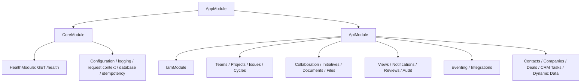

# Fresh NestJS architecture

The previous business implementations have been replaced with fresh scaffolds. The module graph now expresses ownership only; it does not expose product APIs or implement the [target ERD](../../../docs/database/linear-workspace.dbml).



## Ownership and layout

See [the module inventory](../src/modules/README.md) for all 20 boundaries. All feature modules are empty `@Module({})` entry points with tracked layer directories:

```text
modules/<feature>/
  <feature>.module.ts
  domain/
  application/
    ports/
  infrastructure/
  presentation/
    dto/
```

Domain contains business values/policies and remains independent of Nest, transport and persistence. Application contains use cases and narrow ports; infrastructure provides Drizzle/provider adapters and resource guards; presentation owns controllers/DTOs. ESLint rejects direct Nest/ORM/adapter imports from domain files. Add actual files when behavior is implemented, rather than placeholder CRUD returning misleading success.

`CoreModule` retains validated configuration, logger/context, database lifecycle, common idempotency, global validation/interceptors/filter and liveness. `application.factory.ts` owns Fastify, CORS, Helmet, Swagger, URI versioning and shutdown hooks. Only platform modules are shared globally where the existing infrastructure requires it. No authentication guard is currently registered because IAM is a fresh scaffold.

## Implementation conventions

- Use constructor injection with explicit DI tokens for ports. Register each concrete adapter once and bind its port with `useExisting` when that instance is shared.
- Export only capabilities required by another module. Import the owning module; do not duplicate its providers or hide cycles with `forwardRef`.
- Validate typed DTOs at the HTTP boundary. Register authentication and workspace/resource authorization before mounting business endpoints; composite tenant FKs alone do not authorize reads.
- Keep CRM Tasks distinct from product Issues. Coordinate cross-feature behavior through narrow application contracts and durable events, while committing business mutations and event facts in the same transaction.
- Keep controllers thin and persistence queries inside adapters. Enforce tenant predicates, lifecycle rules and transactional invariants consistently.
- Tests belong beside behavior as `*.spec.ts`; HTTP tests live in `test/`. Use port overrides for isolated behavior, plus actual PostgreSQL tests for constraints and concurrency.

## Build order

Implement IAM/authentication and workspace authorization first, then Teams/status workflows, Projects, Issues and Cycles. Implement versioned event production alongside mutations, not as a later best-effort notification. Add collaboration, files/documents, views and notification consumers next. Initiatives, reviews/integrations and optional CRM/Dynamic Data follow accepted launch scope. Intake, releases/SLA and AI agents are not initialized in this reset.

Existing database schemas/migrations are retained as historical artifacts and must be reconciled with the proposed ERD. No database migration, drop or data reset occurred. The retained common idempotency path is not yet coordinated with new feature transactions; implement its crash/replay guarantees before enabling authenticated mutations.

## Validation scope

Platform unit tests and HTTP startup/liveness/removed-route tests validate this scaffold. Passing them does not prove authentication, authorization, business behavior, providers, workers or persistence because those implementations are absent. Follow the [database review](../../../docs/database/design-review.md) before shipping.

The composition follows Nest's [module guidance](https://docs.nestjs.com/modules) and [custom-provider guidance](https://docs.nestjs.com/fundamentals/custom-providers).
