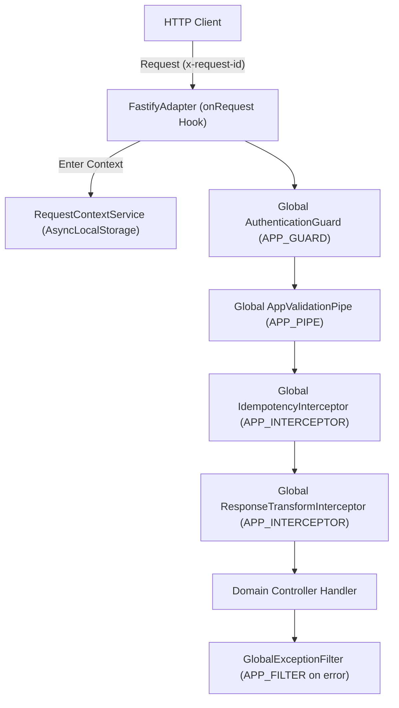
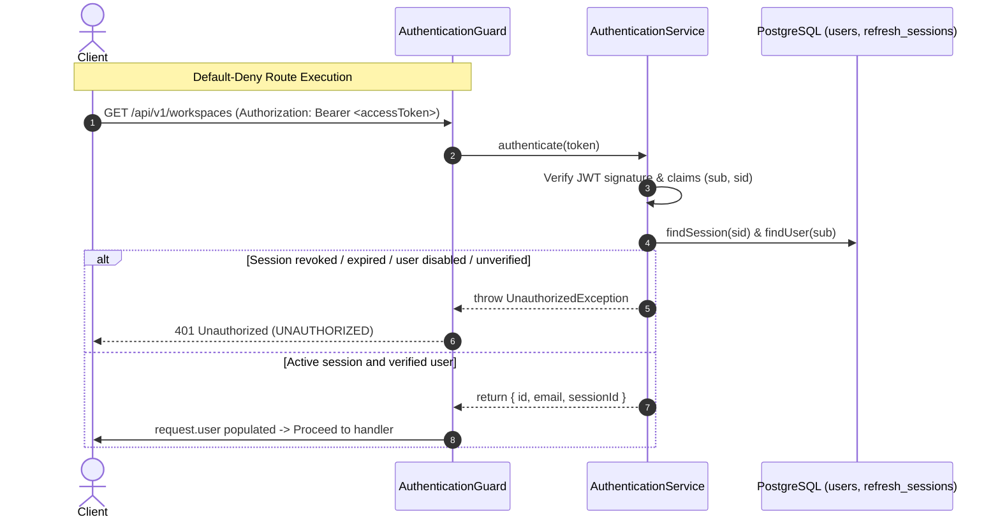
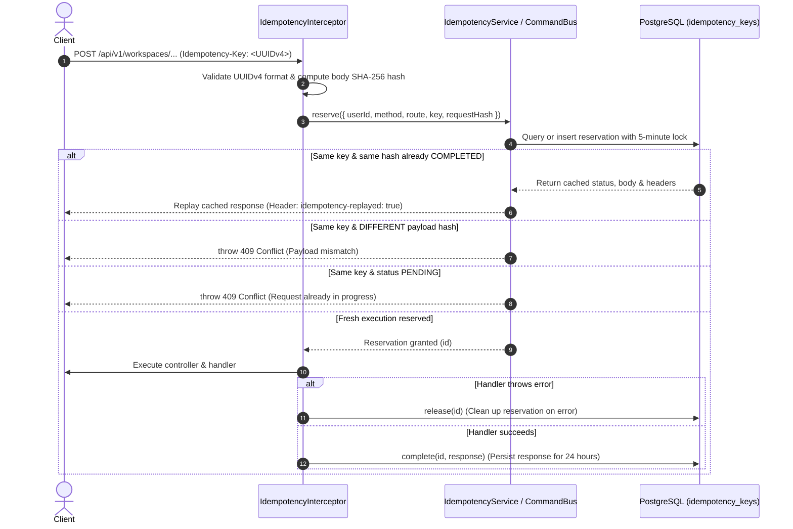

# Tream Backend API Conventions Reference

This document provides the authoritative specification of the global backend architecture, routing, protocols, security policies, and response envelopes for the Tream NestJS application ([`apps/server`](file:///Users/narak/Documents/narakcode/turbo-repo/tream-app/apps/server)). It serves as the primary technical reference for all module-specific API documentation across the repository.

---

## 1. Global Setup, URL Prefix & Versioning

### 1.1 Bootstrap Architecture & Fastify Adapter

The application entrypoint ([`main.ts`](file:///Users/narak/Documents/narakcode/turbo-repo/tream-app/apps/server/src/main.ts#L6)) bootstraps a NestJS application via [`createApplication()`](file:///Users/narak/Documents/narakcode/turbo-repo/tream-app/apps/server/src/application.factory.ts#L127) using the Fastify HTTP platform adapter ([`FastifyAdapter`](file:///Users/narak/Documents/narakcode/turbo-repo/tream-app/apps/server/src/application.factory.ts#L40)).



Key runtime parameters configured on the adapter ([`application.factory.ts`](file:///Users/narak/Documents/narakcode/turbo-repo/tream-app/apps/server/src/application.factory.ts#L40-L49)):

- **Request Body Limits**:
  - Default JSON body limit: `1,048,576 bytes` (1 MiB) via `bodyLimit: 1024 * 1024`.
  - Binary file streams (`application/octet-stream`): Configured explicitly via `addContentTypeParser` using `files.maxFileBytes` (default: 25 MiB / `26,214,400 bytes`) ([`application.factory.ts`](file:///Users/narak/Documents/narakcode/turbo-repo/tream-app/apps/server/src/application.factory.ts#L72-L79)).
- **Reverse Proxy Support**: Configured via `trustProxy: Number.parseInt(process.env.TRUST_PROXY_HOPS ?? '0', 10) || false`.
- **Request ID Handling**:
  - Incoming header: `x-request-id`.
  - Generator: [`createRequestId()`](file:///Users/narak/Documents/narakcode/turbo-repo/tream-app/apps/server/src/common/context/request-context.service.ts#L12). If an incoming `x-request-id` matches UUID or ULID patterns, it is retained; otherwise, a fresh ID is generated with prefix `req_<ulid>`.
  - Outgoing header: In the `onRequest` Fastify hook, `reply.header('x-request-id', request.id)` ensures every response echoes the request ID ([`application.factory.ts`](file:///Users/narak/Documents/narakcode/turbo-repo/tream-app/apps/server/src/application.factory.ts#L110)).
  - Context isolation: The request ID is stored in [`RequestContextService`](file:///Users/narak/Documents/narakcode/turbo-repo/tream-app/apps/server/src/common/context/request-context.service.ts#L18) using Node.js `AsyncLocalStorage`.
- **CORS**: Configured via `@fastify/cors` with `origin` parsed from `app.corsOrigin` (comma-delimited), `credentials: true`, and standard HTTP methods ([`application.factory.ts`](file:///Users/narak/Documents/narakcode/turbo-repo/tream-app/apps/server/src/application.factory.ts#L80-L87)).
- **Security Headers**: Enabled via `@fastify/helmet`. When Swagger is enabled, helmet injects CSP directives accommodating the Swagger UI ([`application.factory.ts`](file:///Users/narak/Documents/narakcode/turbo-repo/tream-app/apps/server/src/application.factory.ts#L90-L103)).

### 1.2 URL Prefixing & Versioning Scheme

- **Global API Prefix**: `/api` (configured via `app.setGlobalPrefix('api')` in [`application.factory.ts`](file:///Users/narak/Documents/narakcode/turbo-repo/tream-app/apps/server/src/application.factory.ts#L60)).
- **API Versioning**: URI-based versioning with default version `'1'` (configured via `app.enableVersioning({ type: VersioningType.URI, defaultVersion: '1' })` in [`application.factory.ts`](file:///Users/narak/Documents/narakcode/turbo-repo/tream-app/apps/server/src/application.factory.ts#L66)).
- **Canonical API Path Pattern**:
  ```http
  /api/v1/<resource-path>
  ```
- **Prefix & Version Exclusions**:
  - Health check endpoints (`/health` and `/health/ready`) are excluded from the `/api` prefix ([`application.factory.ts`](file:///Users/narak/Documents/narakcode/turbo-repo/tream-app/apps/server/src/application.factory.ts#L61-L64)) and set to `VERSION_NEUTRAL` ([`health.controller.ts`](file:///Users/narak/Documents/narakcode/turbo-repo/tream-app/apps/server/src/core/health/health.controller.ts#L14)).
  - Excluded routes are accessed directly at `/health` and `/health/ready`.
- **OpenAPI / Swagger Documentation**:
  - Mounted at `/docs` when `SWAGGER_ENABLED=true` (defaults to `true` in development) ([`application.factory.ts`](file:///Users/narak/Documents/narakcode/turbo-repo/tream-app/apps/server/src/application.factory.ts#L37,L89)).

---

## 2. Global Validation Pipe (`AppValidationPipe`)

Global input validation is provided by [`AppValidationPipe`](file:///Users/narak/Documents/narakcode/turbo-repo/tream-app/apps/server/src/common/pipes/validation.pipe.ts#L28), registered as `APP_PIPE` in [`CoreModule`](file:///Users/narak/Documents/narakcode/turbo-repo/tream-app/apps/server/src/core/core.module.ts#L31).

### 2.1 Configuration Options

- **`whitelist: true`**: Automatically strips any properties not present in the target DTO.
- **`forbidNonWhitelisted: true`**: Rejects requests containing unrecognized properties, throwing a validation failure.
- **`transform: true` & `enableImplicitConversion: true`**: Automatically transforms raw request query/body objects into instances of their respective DTO classes.

### 2.2 Omitted Field Pruning for Partial Updates (PATCH)

Class constructors or decorated optional fields can materialize as `undefined`. `AppValidationPipe.transform` executes a custom recursive `prune()` routine ([`validation.pipe.ts`](file:///Users/narak/Documents/narakcode/turbo-repo/tream-app/apps/server/src/common/pipes/validation.pipe.ts#L37-L45)):

- Any property with a value strictly equal to `undefined` is deleted from the materialized object.
- Explicit `null`, `false`, and `0` values are retained.
- **Rationale**: This preserves semantic field omission for `PATCH` requests and event diff generation (distinguishing between "do not modify" vs "set to null").

### 2.3 Exception Factory & Error Flattening

When validation fails, `exceptionFactory` executes [`flattenErrors()`](file:///Users/narak/Documents/narakcode/turbo-repo/tream-app/apps/server/src/common/pipes/validation.pipe.ts#L11-L26) to recursively traverse nested `ValidationError` trees:

- Constructs dot-delimited field paths (e.g. `parent.child.property`).
- Aggregates constraint violation messages into an array of strings.
- Throws a [`ValidationException`](file:///Users/narak/Documents/narakcode/turbo-repo/tream-app/apps/server/src/common/exceptions/validation.exception.ts#L10) (`status: 400`, `code: VALIDATION_ERROR`).

---

## 3. Authentication, Sessions & Token Refresh

Authentication and user identity are managed by the IAM subsystem ([`iam.module.ts`](file:///Users/narak/Documents/narakcode/turbo-repo/tream-app/apps/server/src/modules/iam/iam.module.ts#L4)), specifically [`AuthenticationModule`](file:///Users/narak/Documents/narakcode/turbo-repo/tream-app/apps/server/src/modules/iam/authentication.module.ts#L17).



### 3.1 Global Authentication Guard (`AuthenticationGuard`)

- **Default-Deny Policy**: [`AuthenticationGuard`](file:///Users/narak/Documents/narakcode/turbo-repo/tream-app/apps/server/src/modules/iam/authentication/presentation/authentication.guard.ts#L15) is registered globally as `APP_GUARD` in [`AuthenticationModule`](file:///Users/narak/Documents/narakcode/turbo-repo/tream-app/apps/server/src/modules/iam/authentication.module.ts#L30). Every endpoint in the system requires authentication unless explicitly exempted.
- **Public Routes**: Routes decorated with [`@Public()`](file:///Users/narak/Documents/narakcode/turbo-repo/tream-app/apps/server/src/common/decorators/public.decorator.ts#L5) bypass the guard (e.g. `/health`, `/api/v1/auth/signup`, `/api/v1/auth/login`, `/api/v1/auth/refresh`).
- **Header Expectation**:
  ```http
  Authorization: Bearer <accessToken>
  ```
  Missing or malformed headers immediately throw `UnauthorizedException('Bearer authentication required')` (HTTP 401).

### 3.2 Access Token Specifications

- **Format**: Signed JWT using the `HS256` algorithm ([`authentication.service.ts`](file:///Users/narak/Documents/narakcode/turbo-repo/tream-app/apps/server/src/modules/iam/authentication/application/authentication.service.ts#L158)).
- **Secret**: Loaded from `auth.jwt.accessSecret` (`JWT_ACCESS_SECRET`).
- **Issuer / Audience**: Configured via `auth.jwt.issuer` (`JWT_ISSUER`, default: `tream-api`) and `auth.jwt.audience` (`JWT_AUDIENCE`, default: `tream-client`).
- **TTL**: Configured via `auth.jwt.accessTtl` (`JWT_ACCESS_TTL`, default: `15m`).
- **Claims Payload**:
  ```json
  {
    "sub": "<userId>",
    "sid": "<sessionId>",
    "iat": 1728100000,
    "exp": 1728100900,
    "iss": "tream-api",
    "aud": "tream-client"
  }
  ```
- **Live Database Revalidation**:
  On every authenticated request, `AuthenticationGuard` delegates to [`AuthenticationService.authenticate()`](file:///Users/narak/Documents/narakcode/turbo-repo/tream-app/apps/server/src/modules/iam/authentication/application/authentication.service.ts#L188-L221), which checks PostgreSQL:
  1. The session (`sid`) exists and is not revoked (`revokedAt === null`).
  2. The session has not expired (`expiresAt > now`).
  3. The session belongs to the user (`session.userId === payload.sub`).
  4. The user exists, is not disabled (`disabledAt === null`), and has verified their email (`emailVerifiedAt !== null`).
     Successful authentication binds [`AuthenticatedPrincipal`](file:///Users/narak/Documents/narakcode/turbo-repo/tream-app/apps/server/src/common/auth/principal.ts#L2) to `request.user`:
  ```ts
  interface AuthenticatedPrincipal {
    id: string;
    email: string;
    sessionId: string;
  }
  ```

### 3.3 Refresh Tokens & Session Rotation

- **Token Generation**: 32 cryptographically secure random bytes encoded as base64url ([`authentication.service.ts`](file:///Users/narak/Documents/narakcode/turbo-repo/tream-app/apps/server/src/modules/iam/authentication/application/authentication.service.ts#L129)).
- **Storage**: Stored in PostgreSQL table `refresh_sessions` strictly as a SHA-256 hash (`tokenHash = sha256(refreshToken)`).
- **TTL**: Configured via `auth.jwt.refreshTtl` (`JWT_REFRESH_TTL`, default: `30d`).
- **Rotation**: Calling `POST /api/v1/auth/refresh` rotates the session family; the prior refresh token is invalidated and a fresh session and token pair are returned.
- **Dual Transport Protocol**:
  1. **Browser Clients (Cookie-based)**:
     - When the client provides an `Origin` header matching `app.corsOrigin`, [`AuthenticationController`](file:///Users/narak/Documents/narakcode/turbo-repo/tream-app/apps/server/src/modules/iam/authentication/presentation/authentication.controller.ts#L51-L74) sets an `HttpOnly`, `SameSite=Strict`, `Path=/api/v1/auth` cookie named `tream_refresh` (with `Secure` in production).
     - The `refreshToken` property is **removed** from the response JSON body to prevent client script exposure.
     - On refresh, the cookie is read automatically.
  2. **Direct API Clients (JSON payload)**:
     - When no `Origin` header is provided (e.g. mobile apps, backend integrations), the `refreshToken` is returned in the response JSON payload.
     - Direct clients pass `{ "refreshToken": "<token>" }` in the JSON body of `POST /api/v1/auth/refresh`.

### 3.4 Browser Origin Guard (`AuthenticationOriginGuard`)

[`AuthenticationOriginGuard`](file:///Users/narak/Documents/narakcode/turbo-repo/tream-app/apps/server/src/modules/iam/authentication/presentation/authentication-origin.guard.ts#L12) is bound to `AuthenticationController` and `ProfileController`:

- If an `Origin` header is present, it is checked against `app.corsOrigin`. Untrusted origins receive `401 Unauthorized` (`Untrusted browser origin`).
- Requests without an `Origin` header (direct API tools, curl, mobile clients) pass through.

### 3.5 Session Revocation Endpoints

- `POST /api/v1/auth/logout`: Revokes the current session (`sid`) and clears the cookie ([`authentication.controller.ts`](file:///Users/narak/Documents/narakcode/turbo-repo/tream-app/apps/server/src/modules/iam/authentication/presentation/authentication.controller.ts#L140-L147)).
- `POST /api/v1/auth/logout-all`: Revokes all sessions belonging to the authenticated user ([`authentication.controller.ts`](file:///Users/narak/Documents/narakcode/turbo-repo/tream-app/apps/server/src/modules/iam/authentication/presentation/authentication.controller.ts#L148-L155)).
- `GET /api/v1/auth/sessions`: Lists active sessions (`id`, `expiresAt`) for the user ([`authentication.controller.ts`](file:///Users/narak/Documents/narakcode/turbo-repo/tream-app/apps/server/src/modules/iam/authentication/presentation/authentication.controller.ts#L156-L158)).
- `DELETE /api/v1/auth/sessions/:id`: Revokes a specific session ([`authentication.controller.ts`](file:///Users/narak/Documents/narakcode/turbo-repo/tream-app/apps/server/src/modules/iam/authentication/presentation/authentication.controller.ts#L159-L167)).

---

## 4. Multi-Tenant Workspace Scoping

Workspaces serve as the root multi-tenant isolation boundary for all organizational resources (teams, projects, issues, cycles, documents, files, notifications, views, audit logs).

### 4.1 URL Route Pattern

All operational work-management endpoints are scoped under a workspace route parameter:

```http
/api/v1/workspaces/:workspaceId/<resource-path>
```

Examples:

- `/api/v1/workspaces/:workspaceId/teams` ([`teams.controller.ts`](file:///Users/narak/Documents/narakcode/turbo-repo/tream-app/apps/server/src/modules/teams/presentation/teams.controller.ts#L36))
- `/api/v1/workspaces/:workspaceId/issues` ([`issues.controller.ts`](file:///Users/narak/Documents/narakcode/turbo-repo/tream-app/apps/server/src/modules/issues/presentation/issues.controller.ts#L33))
- `/api/v1/workspaces/:workspaceId/documents` ([`documents.controller.ts`](file:///Users/narak/Documents/narakcode/turbo-repo/tream-app/apps/server/src/modules/documents/presentation/documents.controller.ts#L30))

### 4.2 Workspace Authorization Guard (`@RequireWorkspacePermission`)

Workspace-level access is gated via [`@RequireWorkspacePermission(permission, options)`](file:///Users/narak/Documents/narakcode/turbo-repo/tream-app/apps/server/src/modules/iam/workspaces/presentation/workspace-permission.guard.ts#L20), which executes [`WorkspacePermissionGuard`](file:///Users/narak/Documents/narakcode/turbo-repo/tream-app/apps/server/src/modules/iam/workspaces/presentation/workspace-permission.guard.ts#L29) and delegates to [`WorkspaceAuthorizationService.require()`](file:///Users/narak/Documents/narakcode/turbo-repo/tream-app/apps/server/src/modules/iam/workspaces/application/workspace-authorization.service.ts#L12).

### 4.3 Security Invariants & Status Codes

1. **Tenant Enumeration & Existence Masking (HTTP 404)**:
   - If the workspace does not exist in the database, OR
   - If the requesting user has no membership record, OR
   - If the user's membership state is not `ACTIVE` (e.g. `SUSPENDED` or `LEFT`), OR
   - If the workspace is soft-deleted (`deletedAt !== null`) and `options.deleted` is not enabled:
   - **The server returns `404 Not Found` (`Workspace not found.`)**.
   - **Security Reason**: The system intentionally returns `404` instead of `403` to prevent unauthenticated or non-member users from probing valid workspace IDs.
2. **Archived Workspace Lock (HTTP 403)**:
   - If `workspace.archivedAt !== null` and `options.archived` is not enabled, the server returns `403 Forbidden` (`Workspace is archived.`).
3. **Role-Based Permission Matrix (HTTP 403)**:
   - Roles: `OWNER`, `ADMIN`, `MEMBER`, `GUEST` ([`permissions.ts`](file:///Users/narak/Documents/narakcode/turbo-repo/tream-app/apps/server/src/modules/iam/workspaces/domain/permissions.ts#L1)).
   - Permissions: `audit.read`, `workspace.read`, `workspace.update`, `workspace.delete`, `membership.read`, `membership.invite`, `membership.change_role`, `team.manage`, `issue.read`, `issue.update`, `preferences.update`.
   - Matrix:
     - `OWNER`: All administrative permissions, plus `workspace.delete` and `audit.read`.
     - `ADMIN`: All administrative permissions (`team.manage`, `membership.*`, `workspace.update`, etc.).
     - `MEMBER`: `workspace.read`, `membership.read`, `issue.read`, `issue.update`, `preferences.update`.
     - `GUEST`: Restricted to `workspace.read` and personal `preferences.update`.
   - If the caller's role lacks the requested permission, the server throws `403 Forbidden` (`Permission denied.`).
4. **Governance Invariants**:
   - `retainsActiveOwner`: Prevents deleting or demoting the last active `OWNER` of a workspace ([`permissions.ts`](file:///Users/narak/Documents/narakcode/turbo-repo/tream-app/apps/server/src/modules/iam/workspaces/domain/permissions.ts#L60-L71)).
   - `canManageRole`: `ADMIN` users cannot modify or assign `OWNER` or `ADMIN` roles; only `OWNER` can modify administrative roles ([`permissions.ts`](file:///Users/narak/Documents/narakcode/turbo-repo/tream-app/apps/server/src/modules/iam/workspaces/domain/permissions.ts#L48-L59)).

---

## 5. Idempotency-Key Rules & Execution Semantics

Idempotency guarantees that mutating requests can be safely retried across network failures without duplicate side effects. Idempotency is enforced by [`IdempotencyInterceptor`](file:///Users/narak/Documents/narakcode/turbo-repo/tream-app/apps/server/src/common/interceptors/idempotency.interceptor.ts#L100), registered globally as `APP_INTERCEPTOR` in [`CoreModule`](file:///Users/narak/Documents/narakcode/turbo-repo/tream-app/apps/server/src/core/core.module.ts#L34).



### 5.1 Monitored Methods & Exemptions

- **Required Methods**: Every authenticated `POST`, `PATCH`, and `DELETE` request requires an `Idempotency-Key` header ([`idempotency.interceptor.ts`](file:///Users/narak/Documents/narakcode/turbo-repo/tream-app/apps/server/src/common/interceptors/idempotency.interceptor.ts#L31)).
- **Exemptions**:
  - Safe HTTP methods (`GET`, `HEAD`, `OPTIONS`).
  - Unauthenticated requests (`!request.user`).
  - Routes decorated with [`@Public()`](file:///Users/narak/Documents/narakcode/turbo-repo/tream-app/apps/server/src/common/decorators/public.decorator.ts#L5).
  - Routes or controllers explicitly decorated with [`@SkipIdempotency()`](file:///Users/narak/Documents/narakcode/turbo-repo/tream-app/apps/server/src/common/decorators/skip-idempotency.decorator.ts#L9) (e.g. `AuthenticationController`, `ProfileController`).

### 5.2 Header Specification & Format

- **Header Name**: `Idempotency-Key`
- **Format**: Must be a valid UUID v4 matching the pattern:
  `/^[0-9a-f]{8}-[0-9a-f]{4}-4[0-9a-f]{3}-[89ab][0-9a-f]{3}-[0-9a-f]{12}$/i`
- **Validation Failure**: If the header is missing or not a valid UUID v4, the server throws `BadRequestException` (HTTP 400):
  `"Idempotency-Key must be a UUID v4 for authenticated POST and PATCH requests."`

### 5.3 Composite Identity Scope

An idempotency reservation identity is composed of 4 dimensions ([`idempotency.types.ts`](file:///Users/narak/Documents/narakcode/turbo-repo/tream-app/apps/server/src/common/idempotency/idempotency.types.ts#L1-L6)):

1. `userId`: Extracted from authenticated principal `request.user.id`.
2. `method`: HTTP method (`POST`, `PATCH`, `DELETE`).
3. `route`: Normalized request path (`request.url.split('?')[0]`).
4. `key`: Lowercased UUID v4 key.

> [!IMPORTANT]
> **Tenant & Resource Isolation**: The normalized `route` includes concrete path parameters (e.g. `/api/v1/workspaces/<workspaceId>/issues`). This prevents cross-tenant or cross-resource replay attacks where a client mistakenly reuses the same idempotency key across different tenants or entity instances.

### 5.4 Payload Fingerprinting & Conflict Handling

- **Canonical Hash**: Request bodies are canonicalized (keys sorted recursively, dates converted to JSON strings) and hashed using `SHA-256` ([`idempotency.interceptor.ts`](file:///Users/narak/Documents/narakcode/turbo-repo/tream-app/apps/server/src/common/interceptors/idempotency.interceptor.ts#L45-L65)).
- **Payload Conflict (HTTP 409)**: If an idempotency key was previously submitted with a different body payload hash, the server throws `ResourceConflictException`:
  `"The Idempotency-Key was already used with a different request payload."`
- **In-Progress Concurrent Lock (HTTP 409)**: If another request with the same composite identity is currently processing (`status: PENDING`), the server throws `ResourceConflictException`:
  `"A request with this Idempotency-Key is already in progress."`

### 5.5 Lifecycles, Replay & Error Release

- **Pending TTL**: `5 minutes` (`300,000 ms`). If a server node crashes mid-execution, the abandoned pending reservation expires automatically.
- **Completed TTL**: `24 hours` (`86,400,000 ms`). Completed responses are retained for 24 hours for replay.
- **Replay Response Format**:
  - Original HTTP status code.
  - Original response body (including response envelope).
  - Preserved replayable headers: `content-type`, `location`, `cache-control`, `etag`, `last-modified`.
  - Added idempotency headers:
    ```http
    idempotency-key: <uuid>
    idempotency-replayed: true
    ```
- **Release on Handler Failure**:
  If the application throws an exception during processing, the interceptor catches the error and executes [`IdempotencyService.release()`](file:///Users/narak/Documents/narakcode/turbo-repo/tream-app/apps/server/src/common/idempotency/idempotency.service.ts#L38-L40), deleting the reservation row. This allows clients to retry failed requests immediately.

### 5.6 Transactional Commands (`@TransactionalCommand`)

Controllers decorated with [`@TransactionalCommand()`](file:///Users/narak/Documents/narakcode/turbo-repo/tream-app/apps/server/src/common/decorators/transactional-command.decorator.ts#L3) delegate reservation handling to [`CommandBus.execute()`](file:///Users/narak/Documents/narakcode/turbo-repo/tream-app/apps/server/src/common/idempotency/command-bus.service.ts#L13-L67):

- Acquires a PostgreSQL transaction-level advisory lock:
  ```sql
  select pg_advisory_xact_lock(hashtextextended(${JSON.stringify([userId, method, route, key])}, 0));
  ```
- Domain modifications and idempotency persistence commit or roll back together atomically.
- Catches deferred database unique/check constraint collisions and normalizes them to `ResourceConflictException` (HTTP 409).

---

## 6. Pagination Shapes & Response Envelopes

All HTTP responses (except HTTP 204 or file streams) are formatted into consistent JSON envelopes by [`ResponseTransformInterceptor`](file:///Users/narak/Documents/narakcode/turbo-repo/tream-app/apps/server/src/common/interceptors/response-transform.interceptor.ts#L59), registered globally in [`CoreModule`](file:///Users/narak/Documents/narakcode/turbo-repo/tream-app/apps/server/src/core/core.module.ts#L35).

### 6.1 Standard Single Entity Envelope

Default envelope for individual resources or non-paginated endpoints:

```json
{
  "data": {
    "id": "01K00000000000000000000000",
    "name": "Design Systems Team",
    "key": "DES"
  },
  "meta": {
    "requestId": "req_01K00000000000000000000000",
    "timestamp": "2026-10-05T20:30:00.000Z"
  }
}
```

OpenAPI documentation: Decorate handlers with [`@ApiStandardResponse(Model)`](file:///Users/narak/Documents/narakcode/turbo-repo/tream-app/apps/server/src/common/decorators/api-standard-response.decorator.ts#L14) or [`@ApiStandardArrayResponse(Model)`](file:///Users/narak/Documents/narakcode/turbo-repo/tream-app/apps/server/src/common/decorators/api-standard-response.decorator.ts#L35).

### 6.2 Cursor-Based Pagination (Production Standard)

Cursor pagination is the standard pagination mechanism across all collection APIs in the repository (e.g. issues, teams, projects, documents, workspaces, cycles, notifications, audit logs).

#### Query Parameters (`CursorPaginationQueryDto`)

Defined in [`CursorPaginationQueryDto`](file:///Users/narak/Documents/narakcode/turbo-repo/tream-app/apps/server/src/common/dto/cursor-pagination-query.dto.ts#L11):

- `cursor`: (Optional) Base64URL-encoded cursor string (max length: 1,024 characters).
- `limit`: (Optional) Number of items to return. Minimum: 1, Maximum: 100, Default: 25.

#### Cursor Format & Encoding

Implemented in [`cursor.ts`](file:///Users/narak/Documents/narakcode/turbo-repo/tream-app/apps/server/src/common/pagination/cursor.ts):

- Opaque string containing base64url-encoded JSON:
  ```json
  {
    "v": 1,
    "createdAt": "2026-10-05T12:00:00.000Z",
    "id": "01K00000000000000000000000"
  }
  ```
- Strict validation: Cursors with invalid base64url encoding, missing fields, or invalid timestamp formats immediately throw [`ValidationException`](file:///Users/narak/Documents/narakcode/turbo-repo/tream-app/apps/server/src/common/exceptions/validation.exception.ts#L10) (HTTP 400).

#### Response Schema (`CursorPaginatedApiResponse<T>`)

Defined in [`api-response.interface.ts`](file:///Users/narak/Documents/narakcode/turbo-repo/tream-app/apps/server/src/common/interfaces/api-response.interface.ts#L33):

```json
{
  "data": [
    {
      "id": "01K00000000000000000000001",
      "title": "Implement auth refresh",
      "createdAt": "2026-10-05T12:00:00.000Z"
    }
  ],
  "meta": {
    "requestId": "req_01K00000000000000000000000",
    "timestamp": "2026-10-05T20:30:00.000Z",
    "cursor": "eyJ2IjoxLCJjcmVhdGVkQXQiOiIyMDI2LTEwLTA1VDEyOjAwOjAwLjAwMFoiLCJpZCI6IjAxSzAwMDAwMDAwMDAwMDAwMDAwMDAwMDAxIn0",
    "nextCursor": "eyJ2IjoxLCJjcmVhdGVkQXQiOiIyMDI2LTEwLTA1VDEyOjAwOjAwLjAwMFoiLCJpZCI6IjAxSzAwMDAwMDAwMDAwMDAwMDAwMDAwMDEifQ",
    "hasNext": true,
    "limit": 25,
    "total": 142
  }
}
```

OpenAPI documentation: Decorate handlers with [`@ApiCursorPaginatedResponse(Model)`](file:///Users/narak/Documents/narakcode/turbo-repo/tream-app/apps/server/src/common/decorators/api-cursor-paginated-response.decorator.ts#L19).

### 6.3 Offset-Based Pagination (Utility Shape)

Defined in [`PaginationQueryDto`](file:///Users/narak/Documents/narakcode/turbo-repo/tream-app/apps/server/src/common/dto/pagination-query.dto.ts#L4) and [`api-response.interface.ts`](file:///Users/narak/Documents/narakcode/turbo-repo/tream-app/apps/server/src/common/interfaces/api-response.interface.ts#L20) for general utility:

- **Query Parameters**:
  - `page`: Minimum: 1, Default: 1.
  - `limit`: Minimum: 1, Maximum: 100, Default: 20.
- **Response Schema (`PaginatedApiResponse<T>`)**:
  ```json
  {
    "data": [ ...items ],
    "meta": {
      "requestId": "req_01K00000000000000000000000",
      "timestamp": "2026-10-05T20:30:00.000Z",
      "page": 1,
      "limit": 20,
      "total": 142,
      "totalPages": 8,
      "hasNext": true,
      "hasPrevious": false
    }
  }
  ```
- **Note**: Domain resources standardize on cursor-based pagination; offset pagination is maintained in shared utilities.

### 6.4 Sorting Query DTO

Shared sorting query parameters are defined in [`BaseSortQueryDto<T>`](file:///Users/narak/Documents/narakcode/turbo-repo/tream-app/apps/server/src/common/dto/sort-query.dto.ts#L4):

- `sortBy`: Optional string matching a key of the entity.
- `sortOrder`: `ASC` | `DESC` (defaults to `DESC` from [`SortOrder`](file:///Users/narak/Documents/narakcode/turbo-repo/tream-app/apps/server/src/common/enums/sort-order.enum.ts#L1)).

### 6.5 Transformation Exclusions (`@SkipResponseTransform`)

- Handlers returning HTTP 204 No Content return an empty body without metadata.
- Endpoints decorated with [`@SkipResponseTransform()`](file:///Users/narak/Documents/narakcode/turbo-repo/tream-app/apps/server/src/common/decorators/skip-transform.decorator.ts#L4) bypass envelope wrapping (e.g. `/health` and `/health/ready`).
- Direct stream responses written to Fastify reply (e.g. file content downloads in `FilesController`) bypass the interceptor.

---

## 7. Standard Error Response Format

All errors and exceptions are caught and transformed by [`GlobalExceptionFilter`](file:///Users/narak/Documents/narakcode/turbo-repo/tream-app/apps/server/src/common/filters/global-exception.filter.ts#L40), registered globally as `APP_FILTER` in [`CoreModule`](file:///Users/narak/Documents/narakcode/turbo-repo/tream-app/apps/server/src/core/core.module.ts#L36).

### 7.1 Error Schema (`ApiErrorResponse`)

Defined in [`api-response.interface.ts`](file:///Users/narak/Documents/narakcode/turbo-repo/tream-app/apps/server/src/common/interfaces/api-response.interface.ts#L55):

```json
{
  "error": {
    "code": "VALIDATION_ERROR",
    "message": "Input validation failed.",
    "details": [
      {
        "field": "title",
        "constraints": [
          "title should not be empty",
          "title must be shorter than or equal to 255 characters"
        ]
      }
    ]
  },
  "meta": {
    "requestId": "req_01K00000000000000000000000",
    "timestamp": "2026-10-05T20:30:00.000Z"
  }
}
```

### 7.2 Canonical Error Codes (`AppErrorCode`)

Defined in [`app-error-code.enum.ts`](file:///Users/narak/Documents/narakcode/turbo-repo/tream-app/apps/server/src/common/enums/app-error-code.enum.ts#L1) and mapped from HTTP status codes via [`HTTP_STATUS_ERROR_CODE`](file:///Users/narak/Documents/narakcode/turbo-repo/tream-app/apps/server/src/common/constants/error-codes.constant.ts#L4):

| HTTP Status | Canonical `code`        | Default Message / Context                                           | `details` Type                                    |
| :---------- | :---------------------- | :------------------------------------------------------------------ | :------------------------------------------------ |
| `400`       | `VALIDATION_ERROR`      | `Input validation failed.` (thrown by `AppValidationPipe`)          | `Array<{ field: string, constraints: string[] }>` |
| `400`       | `BAD_REQUEST`           | Syntax error, malformed input, missing/invalid `Idempotency-Key`    | `null`                                            |
| `401`       | `UNAUTHORIZED`          | `Bearer authentication required`, expired session, untrusted origin | `null`                                            |
| `403`       | `FORBIDDEN`             | Missing permission, inactive membership, archived workspace         | `null`                                            |
| `403`       | `EMAIL_NOT_VERIFIED`    | `Verify your email before signing in.`                              | `null`                                            |
| `404`       | `RESOURCE_NOT_FOUND`    | Missing entity or non-member workspace access                       | `null`                                            |
| `409`       | `RESOURCE_CONFLICT`     | Revision mismatch, idempotency conflict, or uniqueness collision    | `null` or object                                  |
| `429`       | `RATE_LIMITED`          | `Too many authentication attempts`                                  | `null`                                            |
| `500`       | `INTERNAL_SERVER_ERROR` | `An unexpected error occurred.`                                     | `null`                                            |
| `503`       | `SERVICE_UNAVAILABLE`   | Database or infrastructure dependency unavailable                   | `null`                                            |

> [!NOTE]
> For unhandled non-HTTP exceptions, `GlobalExceptionFilter` logs the full exception and stack trace via Pino with the active `requestId`, and returns a safe HTTP 500 payload with message `"An unexpected error occurred."` and `details: null` to avoid leaking database schemas or internal code paths.

---

## 8. Rate Limiting & Throttling

### 8.1 Active Implementation: Authentication Rate Limiting

Application-layer rate limiting is implemented specifically for sensitive authentication operations in [`AuthenticationService.throttle()`](file:///Users/narak/Documents/narakcode/turbo-repo/tream-app/apps/server/src/modules/iam/authentication/application/authentication.service.ts#L47) and persisted in PostgreSQL table `auth_rate_buckets` via [`PostgresAuthRepository.throttle()`](file:///Users/narak/Documents/narakcode/turbo-repo/tream-app/apps/server/src/modules/iam/authentication/infrastructure/postgres-auth.repository.ts#L236-L250).

#### Rate Limiting Mechanics

- **Window**: Fixed 1-minute bucket (`Math.floor(Date.now() / 60000) * 60000`).
- **Dual-Key Enforcement**:
  Every throttled request increments and checks two separate bucket keys:
  1. Hashed IP address: `${operation}:ip:${sha256(ip)}`
  2. Hashed normalized email (if provided): `${operation}:email:${sha256(email)}`
- **Configured Limits**:
  - `login` (`/api/v1/auth/login`): **10 requests per minute**.
  - All other sensitive auth actions: **5 requests per minute** (covering `signup`, `refresh`, `password-recovery`, `password-reset`, `email-verification/request`, `email-verification/confirm`, `magic-link/request`, `magic-link/consume`).
- **Exceeded Limit Response**:
  Throws `HttpException('Too many authentication attempts', 429)`. Formatted by `GlobalExceptionFilter` as HTTP 429 with error code `RATE_LIMITED`.

### 8.2 Global / General Endpoint Rate Limiting

- **Current Status**: **[UNVERIFIED]**
- **Observation**: `@nestjs/throttler` (version `^6.5.0`) is present in `apps/server/package.json` dependencies, but `ThrottlerModule` and `ThrottlerGuard` are **NOT** registered in `AppModule`, `CoreModule`, or domain controllers.
- **Architectural Implication**: Non-auth domain endpoints (e.g. `/api/v1/workspaces`, `/api/v1/workspaces/:workspaceId/issues`) currently have **no NestJS-level rate limiting**. Any general request rate limiting is presumed to be handled upstream by reverse proxies or API gateway infrastructure (e.g. NGINX, Cloudflare, AWS ALB) — **[UNVERIFIED]**.

---

## 9. Optimistic Concurrency Control (`expectedRevision`)

High-contention mutable entities (e.g. issues, cycle planning states, comments, documents, initiatives, labels, files) utilize optimistic concurrency control as defined in ADR 0002.

- **Contract**: JSON mutation payloads accept an integer `expectedRevision` field (`@IsInt() @Min(1)`).
- **Enforcement**:
  Inside the owning transaction lock, the service verifies that `row.revision === dto.expectedRevision`.
- **Mismatch (HTTP 409)**:
  Throws `ConflictException` (HTTP 409 `RESOURCE_CONFLICT`):
  `"Expected revision <expected> but found <actual>"`
- **Atomicity**:
  Successful writes increment `revision = revision + 1`.
- **Idempotency Interplay**:
  Replaying an already-completed command with a stored response succeeds even if the revision has since advanced, as the idempotency cache returns the original response without re-executing the database mutation.
