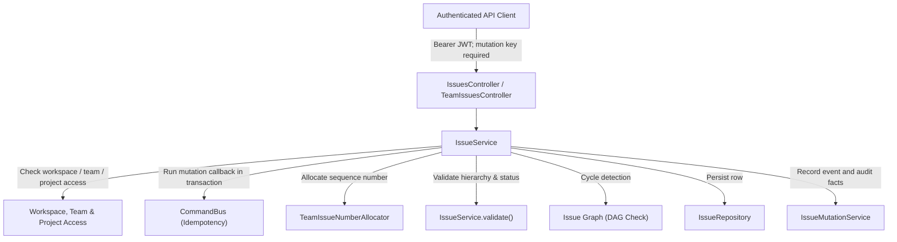

# Issues API Reference

API reference for the mounted NestJS [`IssuesModule`](../apps/server/src/modules/issues/issues.module.ts). It documents the server contract, domain rules, and the current web feature integration for workspace issues, team issue lists, lifecycle commands, transfers, and relations.

The server DTOs and services are the wire-contract source of truth. The shared Zod schemas and web request types currently cover a narrower subset; the differences are listed in [Web feature integration](#6-web-feature-integration).

---

## 1. Overview & Architecture

The issues module owns workspace-scoped work items. It allocates sequential human-readable identifiers per team (for example, `CORE-42`), supports cycle and milestone links, parent/child issue hierarchies, directed relations, and revisioned commands that write event and audit facts in the same transaction.



### Key Components

- **Controllers**:
  - [`IssuesController`](../apps/server/src/modules/issues/presentation/issues.controller.ts#L34): REST endpoints for workspace-level issue listing, identifier lookup, UUID retrieval, creation, updates, lifecycle transitions (archive, restore, delete), team transfers, and relation management.
  - [`TeamIssuesController`](../apps/server/src/modules/issues/presentation/issues.controller.ts#L168): Team-scoped endpoints for listing and creating issues under `/teams/:teamId/issues`.
- **Application Services**:
  - [`IssueService`](../apps/server/src/modules/issues/application/issue.service.ts#L44): Application orchestrator for listing, validation, creation, lifecycle commands, transfers, and relations.
  - [`IssueAccessService`](../apps/server/src/modules/issues/application/issue-access.service.ts): Enforces workspace membership, team visibility (public workspace vs private team), and read/write authorizations.
  - [`IssueMutationService`](../apps/server/src/modules/issues/application/issue-mutation.service.ts): Checks and increments revisions, appends versioned event facts, and writes audit records.
  - [`TeamIssueNumberAllocator`](../apps/server/src/modules/teams/application/team-issue-number-allocator.ts): Allocates the next team issue number and returns the team's usable default status.
- **Domain Graph & Integrity**:
  - [`createsDependencyCycle`](../apps/server/src/modules/issues/domain/issue-graph.ts#L1): Graph traversal used to reject cycles for `BLOCKS` and `DUPLICATES` relations. `RELATED` links are not part of the dependency graph.
  - Parent validation rejects self-parenting and hierarchy cycles and bounds ancestor traversal to 1,000 levels.
- **Repository & Visibility**:
  - [`IssueRepository`](../apps/server/src/modules/issues/infrastructure/issue.repository.ts#L19): Executes cursor-paginated queries filtered by dynamic visibility predicates.
  - [`issueVisibility`](../apps/server/src/modules/issues/infrastructure/issue.repository.ts#L15): Applies current team, project, guest, and ancestor visibility rules to list results.

The module is registered by [`ApiModule`](../apps/server/src/modules/api.module.ts) and follows the repository's [feature-module layout](../apps/server/src/modules/README.md). That inventory links back to this API reference.

---

## 2. Global Policies & Behaviors

### URL Routing & Versioning

- **Global Prefix**: `/api`
- **API Version**: `v1` (URI versioning)
- These are configured by [`application.factory.ts`](../apps/server/src/application.factory.ts).
- **Base Routes**:
  - Workspace collection: `/api/v1/workspaces/:workspaceId/issues`
  - Team-scoped collection: `/api/v1/workspaces/:workspaceId/teams/:teamId/issues`

### Authentication & Authorization

- All endpoints require an authenticated user with a valid JWT Bearer token:
  ```http
  Authorization: Bearer <accessToken>
  ```
- The caller must be an active member of `workspaceId` with `workspace.read` permission.
- **Team Permissions**:
  - Reads apply current team visibility. Non-guest members can read issues on `WORKSPACE`-visibility teams; `PRIVATE` teams require team membership. Guest visibility is narrower and excludes project-linked issues.
  - Creating, updating, transferring, archiving, restoring, deleting, and changing relations requires write access to the affected team. Transfers and relation changes also require write access to the destination or related issue.
  - Issue detail access also checks linked-project and ancestor visibility. Inaccessible linked resources may be reported as not found.
- **Assignee Constraints**:
  - A newly assigned or changed assignee must be an active, non-guest member of the workspace.
  - If the team is `PRIVATE`, a newly assigned or changed assignee must be a member of that private team.
- **Project & Cycle Constraints**:
  - If assigned to a project, the project must be active and linked to the issue's team.
  - Completed or canceled projects reject open issues.
  - When assigning or changing a cycle, cycles must be enabled on the team and the cycle must be open and belong to that team.

### Human Identifiers & Aliasing

- Each issue receives a monotonically allocated integer `number` in its current team and a canonical `identifier` formatted as `<TEAM_KEY>-<NUMBER>` (e.g. `CORE-1`, `DATA-9`). The number and identifier can change when the issue is transferred.
- When an issue is transferred across teams:
  - It receives a new team number and identifier in the destination team.
  - The previous identifier remains permanently reserved in `issue_identifiers` as an alias, allowing historical links to resolve to the issue's new home via the lookup endpoint. Lookup uses the exact identifier string; it is case-sensitive.

### Concurrency & Optimistic Locking

- Mutations to an existing issue (`PATCH`, `DELETE`, `/archive`, `/restore`, `/transfer`, and relation changes) require a positive integer `expectedRevision`:
  - If `expectedRevision` does not match the stored `revision`, the server throws `HTTP 409 Conflict`.
  - On every successful update, the entity `revision` increments by 1.

### Idempotency & Transactional Commands

- Every issue mutation endpoint is marked with [`@TransactionalCommand()`](../apps/server/src/common/decorators/transactional-command.decorator.ts). Authenticated `POST`, `PATCH`, and `DELETE` requests must include an `Idempotency-Key` header containing a UUID v4:
  ```http
  Idempotency-Key: 9b1deb4d-3b7d-4bad-9bdd-2b0d7b3dcb6d
  ```
- Reusing a key with the same method, route, and request body returns the committed response for up to 24 hours. Reusing it with a different request body returns `409 Conflict`; use a new key for a changed command.

### Outbox Audit Facts

Each mutation transaction appends an outbox audit fact:

- `issue.created`
- `issue.updated`
- `issue.status_changed`
- `issue.assigned`
- `issue.cycle_changed`
- `issue.archived`
- `issue.restored`
- `issue.deleted`
- `issue.transferred`
- `issue.relation_added`
- `issue.relation_removed`
- `issue.label_removed` when a transfer removes labels that are scoped to the previous team.

### HTTP Response Envelopes

Successful HTTP responses use standardized JSON envelopes; errors use `{ "error": { "code", "message", "details" }, "meta": { "requestId", "timestamp" } }`. Endpoint examples that show only `data` omit the common success `meta` fields for brevity.

- **Single Resources**: `{ "data": { ...entity }, "meta": { "requestId", "timestamp" } }`
- **Cursor-paginated Lists**:
  ```json
  {
    "data": [ ...items ],
    "meta": {
      "requestId": "req_01M45ENYSQKQPP5Q5QZNAJ6RMC",
      "timestamp": "2026-10-05T07:15:34.347Z",
      "cursor": null,
      "nextCursor": "eyJ2IjoxLCJjcmVhdGVkQXQiOiIyMDI2LTA5LTEwVDE1OjQwOjUzLjQwNVoiLCJpZCI6ImVhYWNkYjE1LTYxMDItNTc4OS1hNTczLTRmZWVmMmViYzgyNiJ9",
      "hasNext": true,
      "limit": 25,
      "total": 70
    }
  }
  ```

Issue create endpoints and relation creation return `201 Created`; issue update, lifecycle, transfer, and relation removal endpoints return `200 OK`.

Common failures use the same error envelope:

| Status | Typical issue API cause                                                                                                                            |
| :----- | :------------------------------------------------------------------------------------------------------------------------------------------------- |
| `400`  | Invalid DTO/query value, unknown request field, or missing/invalid `Idempotency-Key`.                                                              |
| `401`  | Missing or invalid access token.                                                                                                                   |
| `403`  | The caller lacks workspace, team, project, or issue write permission.                                                                              |
| `404`  | Issue, identifier, team, status, project, milestone, cycle, or relation is missing or hidden by access rules.                                      |
| `409`  | Stale revision, key reused with another body, duplicate relation, invalid lifecycle transition, or a violated issue/team/project/cycle constraint. |

---

## 3. Endpoints Summary

| Method   | Route                                                                   | Access     | Idempotent | Description                                                              |
| :------- | :---------------------------------------------------------------------- | :--------- | :--------- | :----------------------------------------------------------------------- |
| `GET`    | `/api/v1/workspaces/:workspaceId/issues`                                | Member     | No         | List workspace issues with cursor pagination and multi-filters.          |
| `GET`    | `/api/v1/workspaces/:workspaceId/teams/:teamId/issues`                  | Team Read  | No         | List team-scoped issues with cursor pagination and filters.              |
| `POST`   | `/api/v1/workspaces/:workspaceId/issues`                                | Team Write | Yes        | Create a new issue under a specified team.                               |
| `POST`   | `/api/v1/workspaces/:workspaceId/teams/:teamId/issues`                  | Team Write | Yes        | Create a new issue scoped to a team.                                     |
| `GET`    | `/api/v1/workspaces/:workspaceId/issues/identifier/:identifier`         | Member     | No         | Lookup an issue by its human identifier or historical alias.             |
| `GET`    | `/api/v1/workspaces/:workspaceId/issues/:issueId`                       | Member     | No         | Get an issue by its UUID.                                                |
| `PATCH`  | `/api/v1/workspaces/:workspaceId/issues/:issueId`                       | Team Write | Yes        | Update fields on an active issue with optimistic locking.                |
| `POST`   | `/api/v1/workspaces/:workspaceId/issues/:issueId/archive`               | Team Write | Yes        | Archive an active issue.                                                 |
| `POST`   | `/api/v1/workspaces/:workspaceId/issues/:issueId/restore`               | Team Write | Yes        | Restore an archived or deleted issue.                                    |
| `DELETE` | `/api/v1/workspaces/:workspaceId/issues/:issueId`                       | Team Write | Yes        | Soft-delete an active issue.                                             |
| `POST`   | `/api/v1/workspaces/:workspaceId/issues/:issueId/transfer`              | Team Write | Yes        | Transfer an issue to a different team with re-identification.            |
| `GET`    | `/api/v1/workspaces/:workspaceId/issues/:issueId/relations`             | Member     | No         | List dependency relations for an issue.                                  |
| `POST`   | `/api/v1/workspaces/:workspaceId/issues/:issueId/relations`             | Team Write | Yes        | Add a relation (`BLOCKS`, `RELATED`, `DUPLICATES`) with cycle detection. |
| `DELETE` | `/api/v1/workspaces/:workspaceId/issues/:issueId/relations/:relationId` | Team Write | Yes        | Remove a dependency relation between issues.                             |

---

## 4. Endpoints Reference

### 4.1 List Workspace Issues

Returns a cursor-paginated list of issues across the workspace matching optional filter criteria.

- **HTTP Method**: `GET`
- **Route**: `/api/v1/workspaces/:workspaceId/issues`
- **Path Parameters**:
  - `workspaceId` (`string`, required): Workspace UUID.
- **Query Parameters**:
  | Parameter     | Type     | Required | Default    | Allowed Values / Constraints                               | Description                                          |
  | :------------ | :------- | :------- | :--------- | :--------------------------------------------------------- | :--------------------------------------------------- |
  | `limit`       | `number` | No       | `25`       | Integer, `1`–`100`                                         | Page size.                                           |
  | `cursor`      | `string` | No       | `null`     | Opaque string, max 1,024 chars                             | Cursor from `meta.nextCursor` on the preceding page. |
  | `lifecycle`   | `string` | No       | `'active'` | `'active'`, `'archived'`, `'deleted'`                      | Issue lifecycle filter.                              |
  | `teamId`      | `string` | No       | `null`     | Team identifier (max 100 chars)                            | Filter by owning team.                               |
  | `statusId`    | `string` | No       | `null`     | Status identifier (max 100 chars)                          | Filter by issue status.                              |
  | `priority`    | `string` | No       | `null`     | `'NO_PRIORITY'`, `'LOW'`, `'MEDIUM'`, `'HIGH'`, `'URGENT'` | Filter by priority level.                            |
  | `projectId`   | `string` | No       | `null`     | Project identifier (max 100 chars)                         | Filter by associated project.                        |
  | `cycleId`     | `string` | No       | `null`     | Cycle identifier (max 100 chars)                           | Filter by cycle.                                     |
  | `assigneeId`  | `string` | No       | `null`     | Membership identifier (max 100 chars)                      | Filter by assigned member.                           |
  | `createdById` | `string` | No       | `null`     | Membership identifier (max 100 chars)                      | Filter by creator member.                            |
  | `parentId`    | `string` | No       | `null`     | Issue identifier (max 100 chars)                           | Filter by direct parent to list its child issues.    |

IDs are string-valued identifiers in the HTTP DTOs. The database uses UUIDs, but the DTO validators enforce string type and a 100-character maximum rather than a UUID format check. Results are ordered by `createdAt` descending, then `id` descending; `total` counts every matching row before cursor pagination.

- **Success Response** (`200 OK`):
  ```json
  {
    "data": [
      {
        "id": "ec0b6588-64ab-5a6d-aef5-ef9d50504115",
        "workspaceId": "ced841dd-2327-4c44-94e4-cfc8126285f2",
        "teamId": "9a6ca9e0-0091-5f17-a5c9-94f65f04e27f",
        "number": 9,
        "identifier": "DATA-9",
        "revision": 1,
        "archivedAt": null,
        "parentId": null,
        "createdById": "409e31af-e9c4-50d6-a484-801bfeda481f",
        "title": "Review customer feedback after launch — Billing Refresh",
        "description": "Confirm acceptance criteria and attach rollout notes.",
        "statusId": "39653381-98c0-5351-a599-6fcd39eaa53a",
        "priority": "HIGH",
        "assigneeId": "d7a028cb-7c6c-54dd-a9bf-539ff01de997",
        "projectId": "1e321e6a-9aeb-5b86-a7c2-d4a84e93cba3",
        "milestoneId": "d2441d85-5ea9-5aa8-ab13-7deac25d430f",
        "cycleId": "c12cc187-5cb7-5502-a46e-756c415a2eca",
        "dueDate": "2026-10-14T15:40:53.405Z",
        "estimate": 5,
        "sortOrder": 6800,
        "createdAt": "2026-09-10T15:40:53.405Z",
        "updatedAt": "2026-10-03T23:21:41.405Z",
        "deletedAt": null
      }
    ],
    "meta": {
      "requestId": "req_01M45ENYSQKQPP5Q5QZNAJ6RMC",
      "timestamp": "2026-10-05T07:15:34.347Z",
      "cursor": null,
      "nextCursor": "eyJ2IjoxLCJjcmVhdGVkQXQiOiIyMDI2LTA5LTEwVDE1OjQwOjUzLjQwNVoiLCJpZCI6ImVhYWNkYjE1LTYxMDItNTc4OS1hNTczLTRmZWVmMmViYzgyNiJ9",
      "hasNext": true,
      "limit": 1,
      "total": 70
    }
  }
  ```

---

### 4.2 List Team Issues

Convenience endpoint scoping issue listing directly to a team.

- **HTTP Method**: `GET`
- **Route**: `/api/v1/workspaces/:workspaceId/teams/:teamId/issues`
- **Path Parameters**:
  - `workspaceId` (`string`, required): Workspace UUID.
  - `teamId` (`string`, required): Team UUID.
- **Query Parameters**: Same as 4.1, except `teamId` is fixed by the route path (`limit`, `cursor`, `lifecycle`, `statusId`, `priority`, etc.).
- **Success Response** (`200 OK`): Paginated envelope matching 4.1.

---

### 4.3 Create Issue

Creates a new issue within a workspace under the specified `teamId`.

- **HTTP Method**: `POST`
- **Route**: `/api/v1/workspaces/:workspaceId/issues`
- **Headers**:
  - `Authorization`: `Bearer <token>`
  - `Idempotency-Key`: `<uuid-v4>` (required)
- **Request Body**:
  ```json
  {
    "teamId": "9a6ca9e0-0091-5f17-a5c9-94f65f04e27f",
    "title": "Migrate dot indicator to AvatarBadge",
    "description": "Refactor inbox item title to use shared UI AvatarBadge component.",
    "priority": "MEDIUM",
    "statusId": "39653381-98c0-5351-a599-6fcd39eaa53a",
    "assigneeId": "d7a028cb-7c6c-54dd-a9bf-539ff01de997",
    "projectId": "1e321e6a-9aeb-5b86-a7c2-d4a84e93cba3",
    "cycleId": "c12cc187-5cb7-5502-a46e-756c415a2eca",
    "parentId": null,
    "dueDate": "2026-10-20T18:00:00.000Z",
    "estimate": 3
  }
  ```
- **Validation Rules**:
  - `teamId` (`string`, required): Must identify an active team the caller can write to.
  - `title` (`string`, required): At most 500 characters; must contain a non-whitespace character. The server trims the saved value.
  - `description` (`string | null`, optional): At most 100,000 characters.
  - `statusId` (`string`, optional): Must be an active status in the selected team. If omitted, the team's single usable default status is used; the team must have exactly one default in the `BACKLOG` or `UNSTARTED` category.
  - `priority` (`string`, optional): One of `NO_PRIORITY`, `LOW`, `MEDIUM`, `HIGH`, `URGENT`; defaults to `NO_PRIORITY`.
  - `assigneeId` (`string | null`, optional): Must refer to an active, non-guest workspace member; private teams also require team membership.
  - `projectId` (`string | null`, optional): The project must be active and linked to the issue's team. A completed or canceled project only accepts issues in a completed, canceled, or duplicate status category.
  - `milestoneId` (`string | null`, optional): Requires `projectId` and must belong to that project in this workspace.
  - `cycleId` (`string | null`, optional): The team must have cycles enabled and the cycle must be open and owned by the same team.
  - `parentId` (`string | null`, optional): The parent must be visible and active; self-parenting and hierarchy cycles are rejected.
  - `dueDate` (`ISO 8601 string | null`, optional).
  - `estimate` (`integer | null`, optional): `0`–`1000`.
  - `sortOrder` (`integer`, optional): Signed 32-bit integer.
  - Unknown body fields are rejected by the global validation pipe.
- **Success Response** (`201 Created`):
  ```json
  {
    "data": {
      "id": "b3e0204b-325b-4357-9d7a-cfb395d8eb01",
      "workspaceId": "ced841dd-2327-4c44-94e4-cfc8126285f2",
      "teamId": "9a6ca9e0-0091-5f17-a5c9-94f65f04e27f",
      "number": 10,
      "identifier": "DATA-10",
      "revision": 1,
      "archivedAt": null,
      "parentId": null,
      "createdById": "409e31af-e9c4-50d6-a484-801bfeda481f",
      "title": "Migrate dot indicator to AvatarBadge",
      "description": "Refactor inbox item title to use shared UI AvatarBadge component.",
      "statusId": "39653381-98c0-5351-a599-6fcd39eaa53a",
      "priority": "MEDIUM",
      "assigneeId": "d7a028cb-7c6c-54dd-a9bf-539ff01de997",
      "projectId": "1e321e6a-9aeb-5b86-a7c2-d4a84e93cba3",
      "milestoneId": null,
      "cycleId": "c12cc187-5cb7-5502-a46e-756c415a2eca",
      "dueDate": "2026-10-20T18:00:00.000Z",
      "estimate": 3,
      "sortOrder": 0,
      "createdAt": "2026-10-05T13:10:00.000Z",
      "updatedAt": "2026-10-05T13:10:00.000Z",
      "deletedAt": null
    }
  }
  ```

---

### 4.4 Create Team Issue

Creates an issue directly scoped to the team specified in the route path.

- **HTTP Method**: `POST`
- **Route**: `/api/v1/workspaces/:workspaceId/teams/:teamId/issues`
- **Request Body**: Same as 4.3 with `teamId` omitted from body.
- **Success Response** (`201 Created`): Returns newly allocated issue row in `{ "data": ... }`.

---

### 4.5 Lookup Issue by Identifier

Resolves an issue by its human identifier (e.g. `DATA-9`) or historical alias (if the issue was transferred from another team).

- **HTTP Method**: `GET`
- **Route**: `/api/v1/workspaces/:workspaceId/issues/identifier/:identifier`
- **Path Parameters**:
  - `workspaceId` (`string`, required): Workspace UUID.
  - `identifier` (`string`, required): Exact, case-sensitive identifier string (for example, `DATA-9`).
- **Success Response** (`200 OK`):
  ```json
  {
    "data": {
      "id": "ec0b6588-64ab-5a6d-aef5-ef9d50504115",
      "workspaceId": "ced841dd-2327-4c44-94e4-cfc8126285f2",
      "teamId": "d94c66a1-a6b4-5f02-adad-f92189a4ad3b",
      "number": 14,
      "identifier": "PLAT-14",
      "revision": 3,
      "archivedAt": null,
      "parentId": null,
      "createdById": "409e31af-e9c4-50d6-a484-801bfeda481f",
      "title": "Review customer feedback after launch",
      "description": "Confirm acceptance criteria.",
      "statusId": "39653381-98c0-5351-a599-6fcd39eaa53a",
      "priority": "HIGH",
      "assigneeId": "d7a028cb-7c6c-54dd-a9bf-539ff01de997",
      "projectId": "1e321e6a-9aeb-5b86-a7c2-d4a84e93cba3",
      "milestoneId": null,
      "cycleId": "c12cc187-5cb7-5502-a46e-756c415a2eca",
      "dueDate": "2026-10-14T15:40:53.405Z",
      "estimate": 5,
      "sortOrder": 6800,
      "createdAt": "2026-09-10T15:40:53.405Z",
      "updatedAt": "2026-10-03T23:21:41.405Z",
      "deletedAt": null,
      "resolvedIdentifier": "DATA-9"
    }
  }
  ```
- `identifier` on the issue row is its current canonical identifier. `resolvedIdentifier` echoes the exact value supplied to the lookup route, including when it matched an alias.
- **Error Responses**:
  - `404 Not Found`: Identifier does not exist or caller lacks access to the issue's team/project.

---

### 4.6 Get Issue by ID

Fetches an issue by its primary UUID.

- **HTTP Method**: `GET`
- **Route**: `/api/v1/workspaces/:workspaceId/issues/:issueId`
- **Path Parameters**:
  - `workspaceId` (`string`, required): Workspace UUID.
  - `issueId` (`string`, required): Issue UUID.
- **Success Response** (`200 OK`): Single issue row in `{ "data": ... }`.
- **Lifecycle**: This read may return an archived or soft-deleted issue when the caller still has visibility.
- **Error Responses**:
  - `404 Not Found`: Issue does not exist or caller lacks visibility.

---

### 4.7 Update Issue

Updates mutable attributes of an issue. Requires optimistic locking revision check.

- **HTTP Method**: `PATCH`
- **Route**: `/api/v1/workspaces/:workspaceId/issues/:issueId`
- **Headers**:
  - `Authorization`: `Bearer <token>`
  - `Idempotency-Key`: `<uuid-v4>` (required)
- **Request Body**:
  ```json
  {
    "expectedRevision": 1,
    "title": "Review customer feedback after launch (Updated)",
    "description": "Updated rollout checklist with engineering leads.",
    "statusId": "7e0bbc12-7b74-5121-aa17-4695702855df",
    "priority": "URGENT",
    "assigneeId": "409e31af-e9c4-50d6-a484-801bfeda481f",
    "projectId": null,
    "cycleId": null,
    "dueDate": "2026-10-25T00:00:00.000Z",
    "estimate": 8
  }
  ```
- **Validation Rules**:
  - `expectedRevision` (`number`, required): Positive integer. If stale, throws `409 Conflict`.
  - At least one patch field must be supplied.
  - `teamId` cannot be changed via update; use the transfer endpoint instead.
  - Supported patch fields are `title`, `description`, `statusId`, `priority`, `assigneeId`, `projectId`, `milestoneId`, `cycleId`, `parentId`, `dueDate`, `estimate`, and `sortOrder`. Nullable fields can be set to `null` to clear them; `milestoneId` requires a project, so clear it when removing the project's link.
- **Success Response** (`200 OK`): Returns updated issue with `revision` incremented by 1.

---

### 4.8 Archive Issue

Transitions an active issue to archived state (`archivedAt = now()`).

- **HTTP Method**: `POST`
- **Route**: `/api/v1/workspaces/:workspaceId/issues/:issueId/archive`
- **Headers**:
  - `Authorization`: `Bearer <token>`
  - `Idempotency-Key`: `<uuid-v4>` (required)
- **Request Body**:
  ```json
  {
    "expectedRevision": 2
  }
  ```
- **Success Response** (`200 OK`): Returns updated issue with `archivedAt` populated and `revision` incremented.
- **Error Responses**:
  - `409 Conflict`: Issue is already inactive, or `expectedRevision` mismatch.

---

### 4.9 Restore Issue

Restores an archived or deleted issue back to active status (`archivedAt = null`, `deletedAt = null`).

- **HTTP Method**: `POST`
- **Route**: `/api/v1/workspaces/:workspaceId/issues/:issueId/restore`
- **Headers**:
  - `Authorization`: `Bearer <token>`
  - `Idempotency-Key`: `<uuid-v4>` (required)
- **Request Body**:
  ```json
  {
    "expectedRevision": 3
  }
  ```
- **Success Response** (`200 OK`): Returns restored issue with `archivedAt: null` and `deletedAt: null`.
- **Validation**: Restoring rechecks the issue's current status, project, cycle, milestone, assignee, and parent constraints. A now-invalid link can prevent restoration.

---

### 4.10 Delete Issue

Soft-deletes an issue (`deletedAt = now()`).

- **HTTP Method**: `DELETE`
- **Route**: `/api/v1/workspaces/:workspaceId/issues/:issueId`
- **Headers**:
  - `Authorization`: `Bearer <token>`
  - `Idempotency-Key`: `<uuid-v4>` (required)
- **Request Body**:
  ```json
  {
    "expectedRevision": 2
  }
  ```
- **Success Response** (`200 OK`): Returns issue row with `deletedAt` set.

---

### 4.11 Transfer Issue to Another Team

Transfers an issue to a destination team. Allocates a new sequence number and identifier in the destination team, updates the team status, cleans up incompatible team-scoped labels, and stores the old identifier as an alias.

- **HTTP Method**: `POST`
- **Route**: `/api/v1/workspaces/:workspaceId/issues/:issueId/transfer`
- **Headers**:
  - `Authorization`: `Bearer <token>`
  - `Idempotency-Key`: `<uuid-v4>` (required)
- **Request Body**:
  ```json
  {
    "expectedRevision": 2,
    "teamId": "d94c66a1-a6b4-5f02-adad-f92189a4ad3b",
    "statusId": "7e0bbc12-7b74-5121-aa17-4695702855df",
    "projectId": null,
    "milestoneId": null,
    "cycleId": null
  }
  ```
- **Validation Rules**:
  - Destination `teamId` must differ from the issue's current team.
  - Caller must have write access to the destination team.
  - If `statusId` is omitted, the service attempts to retain an equivalent category status in the target team or falls back to the target team's default status.
  - An explicit status must be active in the destination team. Project, milestone, cycle, and assignee constraints are checked against the destination team.
  - `projectId`, `milestoneId`, and `cycleId` are optional nullable fields; omitted or `null` values clear the corresponding existing link.
  - Team-specific labels that do not belong to the destination team are removed. Workspace labels remain attached.
- **Success Response** (`200 OK`):
  ```json
  {
    "data": {
      "id": "ec0b6588-64ab-5a6d-aef5-ef9d50504115",
      "workspaceId": "ced841dd-2327-4c44-94e4-cfc8126285f2",
      "teamId": "d94c66a1-a6b4-5f02-adad-f92189a4ad3b",
      "number": 14,
      "identifier": "PLAT-14",
      "revision": 3,
      "title": "Review customer feedback after launch",
      "statusId": "7e0bbc12-7b74-5121-aa17-4695702855df",
      "updatedAt": "2026-10-05T13:45:00.000Z"
    }
  }
  ```

---

### 4.12 List Issue Relations

Retrieves all relations where the specified issue is either the source or target.

- **HTTP Method**: `GET`
- **Route**: `/api/v1/workspaces/:workspaceId/issues/:issueId/relations`
- **Path Parameters**:
  - `workspaceId` (`string`, required): Workspace UUID.
  - `issueId` (`string`, required): Issue UUID.
- **Success Response** (`200 OK`):
  ```json
  {
    "data": [
      {
        "id": "933f737e-16ca-4fb1-89a5-d4538459be08",
        "workspaceId": "ced841dd-2327-4c44-94e4-cfc8126285f2",
        "sourceIssueId": "ec0b6588-64ab-5a6d-aef5-ef9d50504115",
        "targetIssueId": "eaacdb15-6102-5789-a573-4feef2ebc826",
        "type": "BLOCKS",
        "createdById": "409e31af-e9c4-50d6-a484-801bfeda481f",
        "createdAt": "2026-10-05T12:00:00.000Z"
      }
    ]
  }
  ```
- **Visibility Filtering**: Relations whose other issue is not visible to the caller are omitted. Both issues must be in the path workspace.

---

### 4.13 Add Issue Relation

Links two issues with a relationship type: `BLOCKS`, `RELATED`, or `DUPLICATES`.

- **HTTP Method**: `POST`
- **Route**: `/api/v1/workspaces/:workspaceId/issues/:issueId/relations`
- **Headers**:
  - `Authorization`: `Bearer <token>`
  - `Idempotency-Key`: `<uuid-v4>` (required)
- **Request Body**:
  ```json
  {
    "expectedRevision": 2,
    "targetIssueId": "eaacdb15-6102-5789-a573-4feef2ebc826",
    "type": "BLOCKS"
  }
  ```
- **Validation Rules**:
  - An issue cannot relate to itself (`409 Conflict`).
  - For `BLOCKS` and `DUPLICATES`, cycle detection rejects a cycle of the same relation type (`409 Conflict`). `RELATED` is stored with its issue IDs in a stable sorted order and does not participate in cycle detection.
  - An existing relation of the same type and issue pair is rejected with `409 Conflict`.
  - Caller must have write permission on both source and target issues.
  - Bumps the issue named in the path's revision by 1. Relations may connect visible issues in different teams in the same workspace.
- **Success Response** (`201 Created`):
  ```json
  {
    "data": {
      "issue": {
        "id": "ec0b6588-64ab-5a6d-aef5-ef9d50504115",
        "revision": 3
      },
      "relation": {
        "id": "a16b7c21-a944-44c9-bc20-b9261a1d8ea8",
        "workspaceId": "ced841dd-2327-4c44-94e4-cfc8126285f2",
        "sourceIssueId": "ec0b6588-64ab-5a6d-aef5-ef9d50504115",
        "targetIssueId": "eaacdb15-6102-5789-a573-4feef2ebc826",
        "type": "BLOCKS",
        "createdById": "409e31af-e9c4-50d6-a484-801bfeda481f",
        "createdAt": "2026-10-05T13:50:00.000Z"
      }
    }
  }
  ```

---

### 4.14 Remove Issue Relation

Deletes a relation between two issues.

- **HTTP Method**: `DELETE`
- **Route**: `/api/v1/workspaces/:workspaceId/issues/:issueId/relations/:relationId`
- **Headers**:
  - `Authorization`: `Bearer <token>`
  - `Idempotency-Key`: `<uuid-v4>` (required)
- **Request Body**:
  ```json
  {
    "expectedRevision": 3
  }
  ```
- **Validation Rules**:
  - Caller must have write access to both issues connected by the relation.
  - Bumps the issue named in the path's revision.
- **Success Response** (`200 OK`): Returns the updated issue row directly in `data`. The web schema adapts this issue into `{ issue, relationId? }` for its hook; the server does not return a `relationId` field.

---

## 5. DTOs and Shared Schemas

The HTTP request contract is defined by the server DTOs in [`issue.dto.ts`](../apps/server/src/modules/issues/presentation/issue.dto.ts): `CreateIssueDto`, `CreateTeamIssueDto`, `UpdateIssueDto`, `TransferIssueDto`, `IssueListDto`, `RelationDto`, and `RevisionDto`. The global validation pipe transforms numeric query values, rejects unknown properties, and returns `400 Bad Request` for invalid DTO input.

The web app's runtime Zod schemas and TypeScript contracts live in [`packages/schemas/src/issue.ts`](../packages/schemas/src/issue.ts), while its feature request payload types are in [`apps/web/features/issues/api.ts`](../apps/web/features/issues/api.ts). Important shared schema exports include:

- `issueItemSchema`, `issueListQuerySchema`, and `issueListResponseSchema` for issue rows and list responses.
- `issueRelationSchema`, `issueRelationListSchema`, and `addIssueRelationResponseSchema` for relation reads and creates.
- `lookupIssueResponseSchema`, `transferIssueSchema`, `relationInputSchema`, and `revisionInputSchema` for the corresponding responses and commands.

The shared request schemas are not yet a complete mirror of the server DTOs. For example, the shared create schema limits `title` to 255 characters while the server accepts up to 500; it omits `milestoneId`, `parentId`, `estimate`, and `sortOrder`, and it does not model nullable `description`. The shared Zod `updateIssueSchema` is derived from that narrower create schema and omits the server-required `expectedRevision`, although the web API request type declares it. Treat the server DTO as authoritative until these contracts are aligned.

### Response models

Issue reads and commands return the persisted issue row with these fields:

| Field                                                           | Wire type and meaning                                                    |
| :-------------------------------------------------------------- | :----------------------------------------------------------------------- |
| `id`, `workspaceId`, `teamId`, `createdById`, `statusId`        | String identifiers.                                                      |
| `number`                                                        | Integer allocated within the current team. It can change on transfer.    |
| `identifier`                                                    | Current `<TEAM_KEY>-<NUMBER>` identifier.                                |
| `revision`                                                      | Positive integer incremented by each successful existing-issue mutation. |
| `title`, `description`                                          | String title (stored trimmed); description is nullable.                  |
| `priority`                                                      | `NO_PRIORITY`, `LOW`, `MEDIUM`, `HIGH`, or `URGENT`.                     |
| `assigneeId`, `projectId`, `milestoneId`, `cycleId`, `parentId` | Nullable string identifiers.                                             |
| `dueDate`, `archivedAt`, `deletedAt`, `createdAt`, `updatedAt`  | ISO date-time strings; nullable dates are `null` when unset.             |
| `estimate`                                                      | Nullable integer; writes accept `0`–`1000`.                              |
| `sortOrder`                                                     | Signed 32-bit integer; defaults to `0`.                                  |
| `resolvedIdentifier`                                            | Lookup-only field echoing the exact input identifier.                    |

Relation rows contain `id`, `workspaceId`, `sourceIssueId`, `targetIssueId`, `type`, `createdById`, and `createdAt`. A relation create wraps an issue row and relation row in `data`; relation deletion returns the updated issue row in `data`.

## 6. Web Feature Integration

The web issue feature is organized under [`apps/web/features/issues`](../apps/web/features/issues). [`issuesApi`](../apps/web/features/issues/api.ts) wraps `@repo/api-client`, validates response envelopes, and exposes `list`, `get`, `lookup`, `create`, `createTeamIssue`, `update`, `archive`, `restore`, `delete`, `transfer`, `relations`, `addRelation`, and `removeRelation`. The server's team-list route is not exposed by this client yet.

[`queries.ts`](../apps/web/features/issues/queries.ts) owns the workspace-scoped `issueKeys` factory and TanStack Query v5 options for lists, details, identifier lookup, and relations. These queries use a 30-second stale time and the list query follows `meta.nextCursor`. [`hooks.ts`](../apps/web/features/issues/hooks.ts) owns mutations; [`cache.ts`](../apps/web/features/issues/cache.ts) prepends created rows, patches list/detail/lookup records after updates, removes deleted rows from lists and detail cache, and updates relation cache entries. These are post-success cache updates followed by list invalidation where configured.

The current browser routes consume the feature at `/[orgId]/issues`, `/[orgId]/my-issues`, and `/[orgId]/issue/[issueId]`. The pages use the shared issue feature and detail components; issue creation is also available through the sidebar's [`CreateNewIssue`](../apps/web/components/layout/sidebar/create-new-issue/index.tsx).

### Current request-contract gaps

- Every authenticated `POST`, `PATCH`, and `DELETE` issue request needs a UUID v4 `Idempotency-Key`. The shared [`ApiClient`](../packages/api-client/src/index.ts) does not generate this header, and the current issue API methods do not provide it. Those browser mutation calls therefore need an idempotency key added before they satisfy the server contract.
- The web `UpdateIssuePayload` currently omits server-supported `milestoneId`, `parentId`, and `sortOrder` fields. The server can update those fields even though this feature payload type does not expose them.
- `removeIssueRelationResponseSchema` adapts the server's bare updated issue response into `{ issue, relationId? }` for the web hook. `relationId` is not present in the server response.

Feature-level API and cache behavior is covered by [`api.test.ts`](../apps/web/features/issues/api.test.ts) and [`cache.test.ts`](../apps/web/features/issues/cache.test.ts). Those tests cover the web client implementation; they do not change the server contract described above.

The server's PostgreSQL-backed HTTP contract suite is [`issues.integration-spec.ts`](../apps/server/test/issues.integration-spec.ts). It exercises identifier allocation and alias lookup, visibility, revisions and idempotent replay, hierarchy and dependency cycles, transfers, and transaction rollback behavior.
