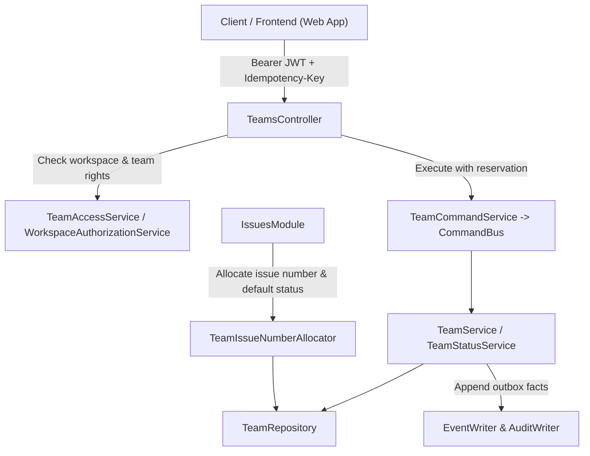

# Teams API Reference

API definition, domain invariants, and architectural reference for the NestJS [`TeamsModule`](file:///Users/narak/Documents/narakcode/turbo-repo/tream-app/apps/server/src/modules/teams/teams.module.ts), covering team lifecycle management, private team visibility, membership administration, cycle & timezone settings, workflow status catalogs, and atomic issue number allocation under `/api/v1/workspaces/:workspaceId/teams`.

---

## 1. Overview & Architecture

The [`TeamsModule`](file:///Users/narak/Documents/narakcode/turbo-repo/tream-app/apps/server/src/modules/teams/teams.module.ts) defines the organizational boundaries for project execution and work tracking within a workspace. Teams own issue identifiers, status workflows, cycles, and membership rosters.



### Key Components

- **Controller**:
  - [`TeamsController`](file:///Users/narak/Documents/narakcode/turbo-repo/tream-app/apps/server/src/modules/teams/presentation/teams.controller.ts): REST controller providing endpoints for team CRUD, member management, cycle settings, and issue status catalog administration.
- **Application Services**:
  - [`TeamService`](file:///Users/narak/Documents/narakcode/turbo-repo/tream-app/apps/server/src/modules/teams/application/team.service.ts): Manages team lifecycles, key registration, retirement integrity checks, workspace member additions/removals, and cycle configuration.
  - [`TeamStatusService`](file:///Users/narak/Documents/narakcode/turbo-repo/tream-app/apps/server/src/modules/teams/application/team-status.service.ts): Manages the workflow status catalog for a team, including default status enforcement, full catalog reordering, and cascading status migration upon retirement.
  - [`TeamAccessService`](file:///Users/narak/Documents/narakcode/turbo-repo/tream-app/apps/server/src/modules/teams/application/team-access.service.ts): Enforces access control across workspace and team boundaries, handling `WORKSPACE` vs `PRIVATE` visibility, guest constraints, and team administration rights.
  - [`TeamCommandService`](file:///Users/narak/Documents/narakcode/turbo-repo/tream-app/apps/server/src/modules/teams/application/team-command.service.ts): Executes mutating actions within an idempotent transaction reservation via [`CommandBus`](file:///Users/narak/Documents/narakcode/turbo-repo/tream-app/apps/server/src/common/idempotency/command-bus.service.ts) and logs structured domain events to [`EventWriter`](file:///Users/narak/Documents/narakcode/turbo-repo/tream-app/apps/server/src/modules/eventing/application/event-writer.service.ts) and [`AuditWriter`](file:///Users/narak/Documents/narakcode/turbo-repo/tream-app/apps/server/src/modules/audit/application/audit-writer.service.ts).
  - [`TeamIssueNumberAllocator`](file:///Users/narak/Documents/narakcode/turbo-repo/tream-app/apps/server/src/modules/teams/application/team-issue-number-allocator.ts): Exported provider consumed by [`IssuesModule`](file:///Users/narak/Documents/narakcode/turbo-repo/tream-app/apps/server/src/modules/issues/issues.module.ts) to atomically claim sequential numbers (`nextIssueNumber`) and resolve the active default status.
- **Domain Policies**:
  - [`team-policy.ts`](file:///Users/narak/Documents/narakcode/turbo-repo/tream-app/apps/server/src/modules/teams/domain/team-policy.ts): Enforces pure business invariants such as cycle setting ranges, terminal category definitions (`COMPLETED`, `CANCELED`, `DUPLICATE`), and team read/manage capabilities.
- **Infrastructure & Persistence**:
  - [`TeamRepository`](file:///Users/narak/Documents/narakcode/turbo-repo/tream-app/apps/server/src/modules/teams/infrastructure/team.repository.ts): Drizzle ORM repository operating on `teams`, `team_memberships`, `issue_statuses`, `issues`, `projects`, and `cycles`.

---

## 2. Global Policies & Invariants

### URL Routing & Versioning

- **Global Prefix**: `/api`
- **API Version**: `v1` (URI versioning)
- **Base Route**: `/api/v1/workspaces/:workspaceId/teams`

### Authentication & Authorization

- All endpoints require an authenticated user with a valid JWT Bearer token:
  ```http
  Authorization: Bearer <accessToken>
  ```
- **Workspace Access**: The caller must be an active member of `workspaceId` with `workspace.read` permission.
- **Team Visibility**:
  - `WORKSPACE`: Accessible by all active non-guest workspace members.
  - `PRIVATE`: Strictly visible **only** to users with an active membership in the team (`team_memberships`). Private teams are hidden from non-members (including workspace owners/admins) and are excluded from lists, counts, and cursor pagination unless the caller is explicitly a team member.
- **Guests**: Workspace guests (`role === 'GUEST'`) cannot view `WORKSPACE` visibility teams unless explicitly added to the team roster. Guests are strictly prohibited from administering teams.
- **Team Management Rights**:
  - Team creation requires workspace-level `team.manage` permission (`OWNER` or `ADMIN`).
  - Updating a team, managing team members, modifying settings, or altering the status catalog requires either being a workspace `OWNER`/`ADMIN` or a team `ADMIN`.

### Team Keys & Sequence Allocation

- **Canonical Key Format**: `^[A-Z][A-Z0-9]{1,9}$` (e.g. `CORE`, `ENG`, `PLAT`). Must start with an uppercase letter, follow with alphanumeric uppercase characters, length 2 to 10 characters.
- **Permanent Reservation**: Team keys are permanently reserved per workspace and **immutable**. Once created, a team key cannot be modified.
- **Atomic Issue Sequencing**: Every team maintains a 32-bit integer counter `nextIssueNumber` starting at `1`. Numbers are incremented with row-level locks via [`TeamIssueNumberAllocator`](file:///Users/narak/Documents/narakcode/turbo-repo/tream-app/apps/server/src/modules/teams/application/team-issue-number-allocator.ts), guaranteeing gapless, unique human identifiers (`<KEY>-<NUMBER>`).

### Initial Team Provisioning

When a team is created:

1. The creator is automatically added as an active `ADMIN` in `team_memberships`.
2. A standard catalog of 6 default statuses is automatically seeded in order:
   - Position 0: `Backlog` (`BACKLOG`, `isDefault = false`)
   - Position 1: `Todo` (`UNSTARTED`, `isDefault = true`)
   - Position 2: `In Progress` (`STARTED`, `isDefault = false`)
   - Position 3: `Done` (`COMPLETED`, `isDefault = false`)
   - Position 4: `Canceled` (`CANCELED`, `isDefault = false`)
   - Position 5: `Duplicate` (`DUPLICATE`, `isDefault = false`)
3. A domain event `team.created` is recorded to the transactional outbox.

### Membership & Administration Invariants

- **Roles**: Team members hold either `MEMBER` or `ADMIN` roles within the team.
- **Sole Administrator Protection**: A team must have at least one active administrator at all times. Demoting or removing the final administrator throws `HTTP 409 Conflict`.
- Concurrent administrator removals are serialized and safe from race conditions.
- Members added to a team must already be active members of the parent workspace.

### Team Retirement

- Teams are soft-deleted by setting `retiredAt` to the current timestamp.
- **Dependency Guard**: A team cannot be retired if it has:
  1. Active issues (issues whose status category is NOT in `COMPLETED`, `CANCELED`, `DUPLICATE`).
  2. Active projects linked to the team.
  3. Active, uncompleted, or uncanceled cycles.
- Attempting to retire a team with unresolved dependencies throws `HTTP 409 Conflict`.
- Retired teams reject all mutations unless explicitly permitted by recovery workflows.

### Workflow Status Invariants

- **Allowed Categories**: `BACKLOG`, `UNSTARTED`, `STARTED`, `COMPLETED`, `CANCELED`, `DUPLICATE`.
- **Default Status**:
  - Each team must have **exactly one** active default status.
  - The default status must belong to either the `BACKLOG` or `UNSTARTED` category.
- **In-Use Category Immutability**:
  - If any issues currently reference a status (`issues.status_id = status.id`), the status category cannot be changed (`HTTP 409 Conflict`).
- **Full Catalog Reordering**:
  - Reordering requires submitting an array containing every active status ID of the team exactly once. Partial or duplicated reorder requests throw `HTTP 400 Bad Request`.
- **Status Retirement & Cascading Replacement**:
  - When a status is retired, it is soft-deleted (`retiredAt = now()`) and excluded from active lists.
  - If the status is currently assigned to active issues or is the team's default status:
    - An explicit `replacementStatusId` in the same team is **mandatory**.
    - All issues referencing the retiring status are atomically migrated to `replacementStatusId`.
    - If the retired status was the default status, the replacement status inherits `isDefault = true` (and must therefore be `BACKLOG` or `UNSTARTED`).
    - Domain events (`issue.status_changed` and `issue_status.retired`) are recorded.

### Cycle & Timezone Invariants

Teams support sprint/cadence cycles configured through settings:

- `timezone`: Valid IANA timezone identifier verified with `Intl.DateTimeFormat`.
- `cycleDurationWeeks`: Integer between `1` and `8` weeks.
- `cycleStartDay`: Day of week integer from `0` (Sunday) to `6` (Saturday).
- `cycleCooldownDays`: Integer from `0` to `14` days (must be strictly less than `cycleDurationWeeks * 7`).
- `upcomingCyclesCount`: Integer from `1` to `10`.
- `cyclesEnabled`: Boolean flag enabling or disabling cycle planning.

### Idempotency & Transactional Commands

- All mutation endpoints (`POST`, `PATCH`, `DELETE`) are decorated with [`@TransactionalCommand()`](file:///Users/narak/Documents/narakcode/turbo-repo/tream-app/apps/server/src/common/decorators/transactional-command.decorator.ts).
- Requests require a valid UUID v4 in the `Idempotency-Key` header:
  ```http
  Idempotency-Key: 7b2fe544-e51b-4f9e-a89c-d07fa823ea9a
  ```
- Retries with the same key, route, user, and payload return the cached response without re-executing logic. Authorization is verified prior to replaying cached results.

### Emitted Outbox Domain Events

Every transaction registers facts to both `events` and `audit_logs`:

- `team.created`
- `team.updated`
- `team.retired`
- `team.member_added`
- `team.member_updated`
- `team.member_removed`
- `team.settings_updated`
- `issue_status.created`
- `issue_status.updated`
- `issue_status.reordered`
- `issue_status.default_changed`
- `issue_status.retired`
- `issue.status_changed` (cascading from status retirement)

---

## 3. Endpoints Summary

All routes are scoped under `/api/v1/workspaces/:workspaceId/teams`.

| Method   | Path                                  | Access Required  | Idempotent | Description                                                                      |
| :------- | :------------------------------------ | :--------------- | :--------- | :------------------------------------------------------------------------------- |
| `GET`    | `/`                                   | Workspace Member | No         | List teams in workspace with cursor pagination. Filtered by visibility.          |
| `POST`   | `/`                                   | Workspace Admin  | Yes        | Create a team, reserve key, add creator as admin, and seed 6 default statuses.   |
| `GET`    | `/:teamId`                            | Team Read        | No         | Get team profile by UUID.                                                        |
| `PATCH`  | `/:teamId`                            | Team Admin       | Yes        | Update team name, description, or visibility. (Key is immutable).                |
| `DELETE` | `/:teamId`                            | Team Admin       | Yes        | Soft-retire a team if no active issues, projects, or cycles remain.              |
| `GET`    | `/:teamId/members`                    | Team Read        | No         | List active members of the team with their roles (`ADMIN`, `MEMBER`).            |
| `POST`   | `/:teamId/members`                    | Team Admin       | Yes        | Add an active workspace member to the team roster.                               |
| `PATCH`  | `/:teamId/members/:membershipId`      | Team Admin       | Yes        | Update a team member's role (`ADMIN` \| `MEMBER`). Protects last admin.          |
| `DELETE` | `/:teamId/members/:membershipId`      | Team Admin       | Yes        | Remove a member from the team. Protects last admin.                              |
| `GET`    | `/:teamId/settings`                   | Team Read        | No         | Retrieve team cycle, cadence, and timezone settings.                             |
| `PATCH`  | `/:teamId/settings`                   | Team Admin       | Yes        | Update cycle duration, cooldown days, start day, timezone, and cycle status.     |
| `GET`    | `/:teamId/statuses`                   | Team Read        | No         | List active issue workflow statuses ordered by `position`.                       |
| `POST`   | `/:teamId/statuses`                   | Team Admin       | Yes        | Add a new workflow status to the team catalog.                                   |
| `POST`   | `/:teamId/statuses/reorder`           | Team Admin       | Yes        | Reorder all active team statuses in an atomic transaction.                       |
| `PATCH`  | `/:teamId/statuses/:statusId`         | Team Admin       | Yes        | Update status name or category (category immutable if in use).                   |
| `POST`   | `/:teamId/statuses/:statusId/default` | Team Admin       | Yes        | Designate a status as the team default (must be `BACKLOG` or `UNSTARTED`).       |
| `DELETE` | `/:teamId/statuses/:statusId`         | Team Admin       | Yes        | Retire a status. Requires replacement if in use or default. Replaces references. |

---

## 4. Endpoints Reference

### 4.1 List Workspace Teams

Retrieves a cursor-paginated list of active teams visible to the authenticated caller. Private teams are omitted unless the caller is a member.

- **HTTP Method**: `GET`
- **Path**: `/api/v1/workspaces/:workspaceId/teams`
- **Query Parameters**:
  - `limit` _(optional, integer, default: 25, min: 1, max: 100)_: Items per page.
  - `cursor` _(optional, string)_: Base64 cursor from previous page.
- **Success Response (`200 OK`)**:
  ```json
  {
    "paginationType": "cursor",
    "cursor": null,
    "limit": 25,
    "total": 3,
    "hasNext": false,
    "items": [
      {
        "id": "9a6ca9e0-0091-5f17-a5c9-94f65f04e27f",
        "workspaceId": "ced841dd-2327-4c44-94e4-cfc8126285f2",
        "name": "Engineering",
        "key": "ENG",
        "description": "Core software development team",
        "visibility": "WORKSPACE",
        "icon": null,
        "color": null,
        "nextIssueNumber": 43,
        "timezone": "UTC",
        "cyclesEnabled": true,
        "cycleDurationWeeks": 2,
        "cycleStartDay": 1,
        "cycleCooldownDays": 0,
        "upcomingCyclesCount": 3,
        "retiredAt": null,
        "createdAt": "2026-09-01T12:00:00.000Z",
        "updatedAt": "2026-10-01T15:30:00.000Z"
      }
    ],
    "nextCursor": null
  }
  ```

---

### 4.2 Create Team

Creates a new team, reserves its canonical uppercase key, enrolls the creator as the initial `ADMIN`, and provisions the initial 6 workflow statuses.

- **HTTP Method**: `POST`
- **Path**: `/api/v1/workspaces/:workspaceId/teams`
- **Headers**:
  - `Idempotency-Key`: UUID v4
- **Request Body**:
  ```json
  {
    "name": "Platform Team",
    "key": "PLAT",
    "description": "Cloud infrastructure and developer productivity",
    "visibility": "WORKSPACE"
  }
  ```
- **Validation Rules**:
  - `name`: Required non-empty string, max 100 characters.
  - `key`: Required uppercase alphanumeric matching `^[A-Z][A-Z0-9]{1,9}$` (2 to 10 characters).
  - `description`: Optional string, max 2000 characters.
  - `visibility`: Optional enum (`WORKSPACE` or `PRIVATE`, defaults to `WORKSPACE`).
- **Success Response (`201 Created`)**:
  ```json
  {
    "id": "7f09ac2b-9e8c-4cb3-a9d1-3213941459a0",
    "workspaceId": "ced841dd-2327-4c44-94e4-cfc8126285f2",
    "name": "Platform Team",
    "key": "PLAT",
    "description": "Cloud infrastructure and developer productivity",
    "visibility": "WORKSPACE",
    "icon": null,
    "color": null,
    "nextIssueNumber": 1,
    "timezone": "UTC",
    "cyclesEnabled": false,
    "cycleDurationWeeks": 2,
    "cycleStartDay": 1,
    "cycleCooldownDays": 0,
    "upcomingCyclesCount": 3,
    "retiredAt": null,
    "createdAt": "2026-10-05T20:10:00.000Z",
    "updatedAt": "2026-10-05T20:10:00.000Z"
  }
  ```

---

### 4.3 Get Team

Retrieves team details by ID. Private teams return `404 Not Found` if the caller is not an active team member.

- **HTTP Method**: `GET`
- **Path**: `/api/v1/workspaces/:workspaceId/teams/:teamId`
- **Success Response (`200 OK`)**:
  ```json
  {
    "id": "7f09ac2b-9e8c-4cb3-a9d1-3213941459a0",
    "workspaceId": "ced841dd-2327-4c44-94e4-cfc8126285f2",
    "name": "Platform Team",
    "key": "PLAT",
    "description": "Cloud infrastructure and developer productivity",
    "visibility": "WORKSPACE",
    "nextIssueNumber": 1,
    "timezone": "UTC",
    "cyclesEnabled": false,
    "cycleDurationWeeks": 2,
    "cycleStartDay": 1,
    "cycleCooldownDays": 0,
    "upcomingCyclesCount": 3,
    "retiredAt": null,
    "createdAt": "2026-10-05T20:10:00.000Z",
    "updatedAt": "2026-10-05T20:10:00.000Z"
  }
  ```

---

### 4.4 Update Team

Updates team name, description, or visibility. The `key` cannot be changed.

- **HTTP Method**: `PATCH`
- **Path**: `/api/v1/workspaces/:workspaceId/teams/:teamId`
- **Headers**:
  - `Idempotency-Key`: UUID v4
- **Request Body**:
  ```json
  {
    "name": "Platform Infrastructure",
    "description": "Core cloud systems and developer tooling",
    "visibility": "PRIVATE"
  }
  ```
- **Success Response (`200 OK`)**: Returns updated team entity.

---

### 4.5 Retire Team

Soft-deletes a team. Fails if the team has active issues, active projects, or unfinished cycles.

- **HTTP Method**: `DELETE`
- **Path**: `/api/v1/workspaces/:workspaceId/teams/:teamId`
- **Headers**:
  - `Idempotency-Key`: UUID v4
- **Success Response (`200 OK`)**:
  ```json
  {
    "id": "7f09ac2b-9e8c-4cb3-a9d1-3213941459a0",
    "retiredAt": "2026-10-05T20:15:00.000Z",
    "updatedAt": "2026-10-05T20:15:00.000Z"
  }
  ```
- **Error Codes**:
  - `409 Conflict`: `"Team has active issues, projects or unfinished cycles."`

---

### 4.6 List Team Members

Lists all active members in the team roster.

- **HTTP Method**: `GET`
- **Path**: `/api/v1/workspaces/:workspaceId/teams/:teamId/members`
- **Success Response (`200 OK`)**:
  ```json
  [
    {
      "id": "18fbdca2-7109-4ce8-8ca0-6e42b2915cb1",
      "membershipId": "409e31af-e9c4-50d6-a484-801bfeda481f",
      "role": "ADMIN",
      "createdAt": "2026-10-05T20:10:00.000Z"
    },
    {
      "id": "bf735a22-2a90-4e4b-9721-a5bf9fa4418f",
      "membershipId": "d7a028cb-7c6c-54dd-a9bf-539ff01de997",
      "role": "MEMBER",
      "createdAt": "2026-10-05T20:12:00.000Z"
    }
  ]
  ```

---

### 4.7 Add Team Member

Adds an existing active workspace member to the team.

- **HTTP Method**: `POST`
- **Path**: `/api/v1/workspaces/:workspaceId/teams/:teamId/members`
- **Headers**:
  - `Idempotency-Key`: UUID v4
- **Request Body**:
  ```json
  {
    "membershipId": "d7a028cb-7c6c-54dd-a9bf-539ff01de997",
    "role": "MEMBER"
  }
  ```
- **Validation & Business Rules**:
  - `membershipId`: Must be a valid UUID of an active workspace membership.
  - `role`: Optional enum (`MEMBER` or `ADMIN`, defaults to `MEMBER`).
  - Workspace guests cannot be granted the `ADMIN` role.
  - Cannot add an existing team member (`409 Conflict`).
- **Success Response (`201 Created`)**:
  ```json
  {
    "id": "bf735a22-2a90-4e4b-9721-a5bf9fa4418f",
    "workspaceId": "ced841dd-2327-4c44-94e4-cfc8126285f2",
    "teamId": "7f09ac2b-9e8c-4cb3-a9d1-3213941459a0",
    "membershipId": "d7a028cb-7c6c-54dd-a9bf-539ff01de997",
    "role": "MEMBER",
    "createdAt": "2026-10-05T20:12:00.000Z",
    "updatedAt": "2026-10-05T20:12:00.000Z"
  }
  ```

---

### 4.8 Update Team Member Role

Changes a member's role between `MEMBER` and `ADMIN`.

- **HTTP Method**: `PATCH`
- **Path**: `/api/v1/workspaces/:workspaceId/teams/:teamId/members/:membershipId`
- **Headers**:
  - `Idempotency-Key`: UUID v4
- **Request Body**:
  ```json
  {
    "role": "ADMIN"
  }
  ```
- **Invariants**:
  - Cannot demote an administrator if they are the sole administrator of the team (`409 Conflict`).
  - Workspace guests cannot be assigned the `ADMIN` role.
- **Success Response (`200 OK`)**: Returns updated team membership entity.

---

### 4.9 Remove Team Member

Removes a member from the team.

- **HTTP Method**: `DELETE`
- **Path**: `/api/v1/workspaces/:workspaceId/teams/:teamId/members/:membershipId`
- **Headers**:
  - `Idempotency-Key`: UUID v4
- **Invariants**:
  - Cannot remove the sole administrator of the team (`409 Conflict`).
- **Success Response (`200 OK`)**:
  ```json
  {
    "membershipId": "d7a028cb-7c6c-54dd-a9bf-539ff01de997",
    "removed": true
  }
  ```

---

### 4.10 Get Team Settings

Retrieves cycle, cadence, and timezone settings.

- **HTTP Method**: `GET`
- **Path**: `/api/v1/workspaces/:workspaceId/teams/:teamId/settings`
- **Success Response (`200 OK`)**:
  ```json
  {
    "timezone": "UTC",
    "cyclesEnabled": true,
    "cycleDurationWeeks": 2,
    "cycleStartDay": 1,
    "cycleCooldownDays": 0,
    "upcomingCyclesCount": 3
  }
  ```

---

### 4.11 Update Team Settings

Modifies cycle cadence, cooldown periods, start day, timezone, or cycle activation.

- **HTTP Method**: `PATCH`
- **Path**: `/api/v1/workspaces/:workspaceId/teams/:teamId/settings`
- **Headers**:
  - `Idempotency-Key`: UUID v4
- **Request Body**:
  ```json
  {
    "timezone": "America/New_York",
    "cyclesEnabled": true,
    "cycleDurationWeeks": 2,
    "cycleStartDay": 1,
    "cycleCooldownDays": 2,
    "upcomingCyclesCount": 4
  }
  ```
- **Validation Constraints**:
  - `timezone`: Must be a valid IANA timezone string.
  - `cycleDurationWeeks`: Integer between 1 and 8.
  - `cycleStartDay`: Integer 0 to 6 (0 = Sunday, 1 = Monday, ..., 6 = Saturday).
  - `cycleCooldownDays`: Integer 0 to 14, and must be strictly `< cycleDurationWeeks * 7`.
  - `upcomingCyclesCount`: Integer 1 to 10.
  - `cyclesEnabled`: Boolean.
- **Success Response (`200 OK`)**: Returns updated team entity.

---

### 4.12 List Workflow Statuses

Returns all active issue statuses for the team, ordered ascending by `position`.

- **HTTP Method**: `GET`
- **Path**: `/api/v1/workspaces/:workspaceId/teams/:teamId/statuses`
- **Success Response (`200 OK`)**:
  ```json
  [
    {
      "id": "11111111-1111-1111-1111-111111111111",
      "teamId": "7f09ac2b-9e8c-4cb3-a9d1-3213941459a0",
      "name": "Backlog",
      "category": "BACKLOG",
      "position": 0,
      "isDefault": false,
      "retiredAt": null,
      "createdAt": "2026-10-05T20:10:00.000Z",
      "updatedAt": "2026-10-05T20:10:00.000Z"
    },
    {
      "id": "22222222-2222-2222-2222-222222222222",
      "teamId": "7f09ac2b-9e8c-4cb3-a9d1-3213941459a0",
      "name": "Todo",
      "category": "UNSTARTED",
      "position": 1,
      "isDefault": true,
      "retiredAt": null,
      "createdAt": "2026-10-05T20:10:00.000Z",
      "updatedAt": "2026-10-05T20:10:00.000Z"
    },
    {
      "id": "33333333-3333-3333-3333-333333333333",
      "teamId": "7f09ac2b-9e8c-4cb3-a9d1-3213941459a0",
      "name": "In Progress",
      "category": "STARTED",
      "position": 2,
      "isDefault": false,
      "retiredAt": null,
      "createdAt": "2026-10-05T20:10:00.000Z",
      "updatedAt": "2026-10-05T20:10:00.000Z"
    }
  ]
  ```

---

### 4.13 Create Workflow Status

Appends a new status to the team's catalog at an optional position.

- **HTTP Method**: `POST`
- **Path**: `/api/v1/workspaces/:workspaceId/teams/:teamId/statuses`
- **Headers**:
  - `Idempotency-Key`: UUID v4
- **Request Body**:
  ```json
  {
    "name": "In Review",
    "category": "STARTED",
    "position": 3
  }
  ```
- **Validation**:
  - `name`: Non-empty string, max 100 characters.
  - `category`: Enum (`BACKLOG`, `UNSTARTED`, `STARTED`, `COMPLETED`, `CANCELED`, `DUPLICATE`).
  - `position`: Optional integer between 0 and current catalog size.
- **Success Response (`201 Created`)**:
  ```json
  {
    "id": "44444444-4444-4444-4444-444444444444",
    "teamId": "7f09ac2b-9e8c-4cb3-a9d1-3213941459a0",
    "name": "In Review",
    "category": "STARTED",
    "position": 3,
    "isDefault": false,
    "retiredAt": null,
    "createdAt": "2026-10-05T20:18:00.000Z",
    "updatedAt": "2026-10-05T20:18:00.000Z"
  }
  ```

---

### 4.14 Reorder Workflow Statuses

Reorders all active statuses in the catalog atomically.

- **HTTP Method**: `POST`
- **Path**: `/api/v1/workspaces/:workspaceId/teams/:teamId/statuses/reorder`
- **Headers**:
  - `Idempotency-Key`: UUID v4
- **Request Body**:
  ```json
  {
    "statusIds": [
      "11111111-1111-1111-1111-111111111111",
      "22222222-2222-2222-2222-222222222222",
      "44444444-4444-4444-4444-444444444444",
      "33333333-3333-3333-3333-333333333333"
    ]
  }
  ```
- **Invariants**: Must provide **every** active status UUID belonging to the team exactly once.
- **Success Response (`201 Created`)**: Returns full reordered status array.

---

### 4.15 Update Workflow Status

Updates a status name or category.

- **HTTP Method**: `PATCH`
- **Path**: `/api/v1/workspaces/:workspaceId/teams/:teamId/statuses/:statusId`
- **Headers**:
  - `Idempotency-Key`: UUID v4
- **Request Body**:
  ```json
  {
    "name": "Code Review"
  }
  ```
- **Invariants**:
  - Category is immutable if any issues currently reference this status.
  - If status is the default status, its category can only be changed to `BACKLOG` or `UNSTARTED`.
- **Success Response (`200 OK`)**: Returns updated status entity.

---

### 4.16 Set Default Workflow Status

Designates a status as the team's default status for newly created issues.

- **HTTP Method**: `POST`
- **Path**: `/api/v1/workspaces/:workspaceId/teams/:teamId/statuses/:statusId/default`
- **Headers**:
  - `Idempotency-Key`: UUID v4
- **Invariants**:
  - Target status must belong to either the `BACKLOG` or `UNSTARTED` category.
  - Automatically unsets `isDefault = false` on the previous default status.
- **Success Response (`201 Created`)**: Returns the updated status entity with `isDefault = true`.

---

### 4.17 Retire Workflow Status

Retires a status from active use. If the status is in use or is default, a replacement status within the same team is required.

- **HTTP Method**: `DELETE`
- **Path**: `/api/v1/workspaces/:workspaceId/teams/:teamId/statuses/:statusId`
- **Headers**:
  - `Idempotency-Key`: UUID v4
- **Request Body**:
  ```json
  {
    "replacementStatusId": "22222222-2222-2222-2222-222222222222"
  }
  ```
- **Invariants**:
  - If the status is referenced by active issues, `replacementStatusId` is mandatory.
  - If the status is the default status:
    - `replacementStatusId` is mandatory.
    - Replacement status category must be `BACKLOG` or `UNSTARTED`.
    - Replacement status automatically becomes the new default status.
  - All existing issues are atomically updated to `replacementStatusId`.
  - Emits `issue_status.retired` and `issue.status_changed` facts.
- **Success Response (`200 OK`)**:
  ```json
  {
    "id": "44444444-4444-4444-4444-444444444444",
    "isDefault": false,
    "retiredAt": "2026-10-05T20:25:00.000Z",
    "updatedAt": "2026-10-05T20:25:00.000Z"
  }
  ```

---

## 5. Integration Across Modules

1. **[`IssuesModule`](file:///Users/narak/Documents/narakcode/turbo-repo/tream-app/apps/server/src/modules/issues/issues.module.ts)**:
   - Injects [`TeamIssueNumberAllocator`](file:///Users/narak/Documents/narakcode/turbo-repo/tream-app/apps/server/src/modules/teams/application/team-issue-number-allocator.ts) to claim atomic issue sequences and verify that the target team has an active default status.
   - Enforces team visibility and write access via [`TeamAccessService`](file:///Users/narak/Documents/narakcode/turbo-repo/tream-app/apps/server/src/modules/teams/application/team-access.service.ts).
2. **[`CyclesModule`](file:///Users/narak/Documents/narakcode/turbo-repo/tream-app/apps/server/src/modules/cycles/cycles.module.ts)**:
   - Reads team cycle settings (`cycleDurationWeeks`, `cycleStartDay`, `cycleCooldownDays`, `upcomingCyclesCount`, `timezone`) to schedule recurring sprint cadences.
3. **[`ProjectsModule`](file:///Users/narak/Documents/narakcode/turbo-repo/tream-app/apps/server/src/modules/projects/projects.module.ts)**:
   - Associates projects with teams via `project_teams` junction table.
4. **[`IamModule`](file:///Users/narak/Documents/narakcode/turbo-repo/tream-app/apps/server/src/modules/iam/workspaces.module.ts)**:
   - Validates workspace-level permissions (`workspace.read`, `team.manage`).
