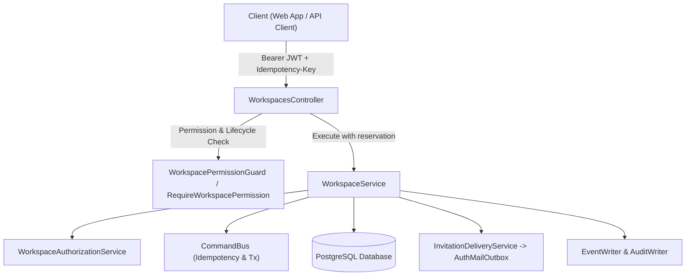

# Workspaces API Reference

For per-membership onboarding completion and bootstrap readiness, see
[Bootstrap and onboarding API](./onboarding-api.md).

API definition, domain invariants, and architectural reference for the NestJS [`WorkspacesController`](file:///Users/narak/Documents/narakcode/turbo-repo/tream-app/apps/server/src/modules/iam/workspaces/presentation/workspaces.controller.ts) and IAM Workspace subsystem, covering workspace provisioning, slug allocation, membership administration, role hierarchies, invitations, member preferences, soft deletion, and 30-day retention policies under `/api/v1/workspaces`.

---

## 1. Overview & Architecture

Workspaces serve as the root multi-tenant isolation boundary for all work management data (teams, projects, issues, cycles, documents, and notifications). Every user operates within the context of one or more workspaces through an active membership.



### Key Components

- **Controller**:
  - [`WorkspacesController`](file:///Users/narak/Documents/narakcode/turbo-repo/tream-app/apps/server/src/modules/iam/workspaces/presentation/workspaces.controller.ts): Exposes 17 endpoints managing workspace CRUD, active selection, roster memberships, role assignment, invitation flows, and preferences.
- **Application Services**:
  - [`WorkspaceService`](file:///Users/narak/Documents/narakcode/turbo-repo/tream-app/apps/server/src/modules/iam/workspaces/application/workspace.service.ts): Orchestrates business workflows, transaction demarcation, outbox event generation, role governance, and last-owner protection rules.
  - [`WorkspaceAuthorizationService`](file:///Users/narak/Documents/narakcode/turbo-repo/tream-app/apps/server/src/modules/iam/workspaces/application/workspace-authorization.service.ts): Validates active membership, role permissions, and lifecycle states (handling archived or deleted workspaces).
  - [`InvitationDeliveryService`](file:///Users/narak/Documents/narakcode/turbo-repo/tream-app/apps/server/src/modules/iam/workspaces/application/invitation-delivery.service.ts): Queues invitation emails in the mail outbox (`AuthMailOutbox`) with secure accept links.
- **Domain Policies & Rules**:
  - [`permissions.ts`](file:///Users/narak/Documents/narakcode/turbo-repo/tream-app/apps/server/src/modules/iam/workspaces/domain/permissions.ts): Enforces pure authorization invariants:
    - Role hierarchy and delegation rules (`canManageRole`)
    - Sole active owner retention rules (`retainsActiveOwner`)
    - Role-to-permission mapping (`matrix`, `hasPermission`)
- **Persistence & Schema**:
  - [`workspace.schema.ts`](file:///Users/narak/Documents/narakcode/turbo-repo/tream-app/apps/server/src/database/schema/workspace.schema.ts): Drizzle schema defining tables `workspaces`, `memberships`, `workspace_invitations`, `workspace_preferences`, and `workspace_selections`.

---

## 2. Global Policies & Invariants

### URL Routing & Versioning

- **Global Prefix**: `/api`
- **API Version**: `v1` (URI versioning)
- **Base Route**: `/api/v1/workspaces`

### Authentication & Idempotency

- All endpoints require an authenticated user with a valid JWT Bearer token:
  ```http
  Authorization: Bearer <accessToken>
  ```
- Mutating commands (`POST`, `PATCH`, `DELETE`) are wrapped in `@TransactionalCommand()` and executed through [`CommandBus`](file:///Users/narak/Documents/narakcode/turbo-repo/tream-app/apps/server/src/common/idempotency/command-bus.service.ts).
- Pass an `Idempotency-Key: <UUIDv4>` header on mutating operations to prevent duplicate execution across retries.

### Success Response Envelope

Successful responses use the shared API envelope. Unless a code block below shows the full envelope, its example is the value inside `data`:

```json
{
  "data": {},
  "meta": {
    "requestId": "req_01J9X4Y8...",
    "timestamp": "2026-10-05T20:00:00.000Z"
  }
}
```

Cursor-paginated responses put the page items in `data` and pagination fields in `meta`. `paginationType` and `items` are internal service fields and are not sent over HTTP:

```json
{
  "data": [],
  "meta": {
    "requestId": "req_01J9X4Y8...",
    "timestamp": "2026-10-05T20:00:00.000Z",
    "cursor": null,
    "nextCursor": null,
    "hasNext": false,
    "limit": 50,
    "total": 0
  }
}
```

### Roles & Permission Matrix

| Permission               | Description                                    | OWNER | ADMIN | MEMBER | GUEST |
| ------------------------ | ---------------------------------------------- | :---: | :---: | :----: | :---: |
| `workspace.read`         | View workspace metadata and access content     |  Yes  |  Yes  |  Yes   |  Yes  |
| `workspace.update`       | Update workspace name, archive, or restore     |  Yes  |  Yes  |   No   |  No   |
| `workspace.delete`       | Soft-delete / trash workspace                  |  Yes  |  No   |   No   |  No   |
| `audit.read`             | Inspect audit logs and events                  |  Yes  |  No   |   No   |  No   |
| `membership.read`        | List roster members                            |  Yes  |  Yes  |  Yes   |  No   |
| `membership.invite`      | Send, list, or revoke invitations              |  Yes  |  Yes  |   No   |  No   |
| `membership.change_role` | Update roles, suspend, or remove members       |  Yes  |  Yes  |   No   |  No   |
| `team.manage`            | Create, configure, or retire teams             |  Yes  |  Yes  |   No   |  No   |
| `issue.read`             | Read issues                                    |  Yes  |  Yes  |  Yes   |  No   |
| `issue.update`           | Create and modify issues                       |  Yes  |  Yes  |  Yes   |  No   |
| `preferences.update`     | Read and update personal workspace preferences |  Yes  |  Yes  |  Yes   |  Yes  |

### Role Hierarchy & Management Rules (`canManageRole`)

To prevent privilege escalation:

- **`OWNER`**: Can assign, promote, demote, or invite any role (`OWNER`, `ADMIN`, `MEMBER`, `GUEST`).
- **`ADMIN`**: Can only invite and manage `MEMBER` and `GUEST` roles. Admins **cannot** promote users to `ADMIN` or `OWNER`, nor can they modify or remove existing `ADMIN` or `OWNER` memberships.
- Attempting to manage an unauthorized role throws `HTTP 403 Forbidden` (`Privileged membership requires an owner.`).

### Sole Active Owner Protection (`retainsActiveOwner`)

A workspace must maintain at least one `ACTIVE` `OWNER` at all times:

- An owner cannot be demoted to `ADMIN`, `MEMBER`, or `GUEST` if they are the last active owner.
- An owner cannot be suspended or removed if they are the last active owner.
- An owner cannot leave the workspace (`POST /workspaces/:id/leave`) if they are the last active owner.
- Violating this invariant throws `HTTP 409 Conflict` (`Workspace requires an active owner.`).

### Workspace Lifecycle & Retention Policy

1. **Active**: Standard operating state (`archivedAt: null`, `deletedAt: null`).
2. **Archived**: Read-only state (`archivedAt` is set). Mutations reject with `HTTP 403 Forbidden` (`Workspace is archived.`).
3. **Trash (Soft-deleted)**: Soft-deleted by setting `deletedAt`. Hidden from standard queries.
   - **30-Day Recovery Window**: A trashed workspace can be restored by an `OWNER` within 30 days (`30 * 86400000 ms`).
   - If `deletedAt` is older than 30 days, restoration fails with `HTTP 409 Conflict` (`Workspace trash retention expired.`).
   - Only `OWNER` can restore a trashed workspace.
   - Database check constraint `workspace_lifecycle_exclusive` ensures a workspace cannot be simultaneously archived and deleted.

### Slug Formatting & Uniqueness

- **Format**: Lowercase alphanumeric with optional single hyphens (`^[a-z0-9]+(?:-[a-z0-9]+)*$`). Length between 3 and 60 characters.
- **Uniqueness**: Enforced by unique index `workspaces_slug_idx`. Conflicting slugs throw `HTTP 409 Conflict` (`This workspace slug is already taken. Choose a different slug.`).

### Invitation Security & Delivery

- **Token Generation**: 32 cryptographically secure random bytes encoded as `base64url` (43 characters).
- **Storage**: Only the SHA-256 hash (`tokenHash`) is stored in the database. The raw token is never persisted.
- **Expiration**: Invitations expire 7 days after creation (`expiresAt = now + 7 days`).
- **Single Pending per Email**: Creating a new invitation automatically marks any existing pending invitations for that email in the workspace as expired.
- **Acceptance Verification**:
  - The user accepting the invitation must have a **verified email address** matching the invitation email.
  - The invitation issuer must still be an active member who currently possesses the authority to grant that role.
  - If the user previously left the workspace (`state: 'LEFT'`), the membership is reactivated; otherwise, a new membership is created.

---

## 3. Endpoints Reference

### 3.1 Workspaces

#### `GET /api/v1/workspaces`

List workspaces accessible to the authenticated user with cursor-based pagination.

- **Query Parameters**:
  - `limit` _(optional, number, default: 50, max: 100)_: Items per page.
  - `cursor` _(optional, string)_: Opaque pagination cursor.
- **Response**: `200 OK`
  ```json
  {
    "data": [
      {
        "id": "ced841dd-2327-4c44-94e4-cfc8126285f2",
        "name": "Northstar",
        "slug": "northstar",
        "settings": {},
        "createdAt": "2026-09-01T10:00:00.000Z",
        "updatedAt": "2026-09-01T10:00:00.000Z",
        "archivedAt": null,
        "deletedAt": null,
        "purgedAt": null
      }
    ],
    "meta": {
      "requestId": "req_01J9X4Y8...",
      "timestamp": "2026-10-05T20:00:00.000Z",
      "cursor": null,
      "nextCursor": null,
      "hasNext": false,
      "limit": 50,
      "total": 2
    }
  }
  ```

---

#### `POST /api/v1/workspaces`

Create a new workspace. The creator is automatically provisioned as the active `OWNER` and the workspace is set as the user's active selection.

- **Headers**: `Idempotency-Key: <UUIDv4>`
- **Request Body**:
  ```json
  {
    "name": "Acme Corp",
    "slug": "acme-corp"
  }
  ```
- **Response**: `201 Created`
  ```json
  {
    "id": "409e31af-e9c4-50d6-a484-801bfeda481f",
    "name": "Acme Corp",
    "slug": "acme-corp",
    "settings": {},
    "createdAt": "2026-10-05T20:00:00.000Z",
    "updatedAt": "2026-10-05T20:00:00.000Z",
    "archivedAt": null,
    "deletedAt": null,
    "purgedAt": null
  }
  ```
- **Errors**:
  - `400 Bad Request`: Validation failure (name missing/too long, invalid slug format).
  - `409 Conflict`: Slug already in use (`workspaces_slug_idx`).

---

#### `GET /api/v1/workspaces/active`

Retrieve the currently selected active workspace and membership details for the authenticated user.

- **Response**: `200 OK`
  ```json
  {
    "workspaceId": "ced841dd-2327-4c44-94e4-cfc8126285f2",
    "workspace": {
      "id": "ced841dd-2327-4c44-94e4-cfc8126285f2",
      "name": "Northstar",
      "slug": "northstar",
      "settings": {},
      "createdAt": "2026-09-01T10:00:00.000Z",
      "updatedAt": "2026-09-01T10:00:00.000Z",
      "archivedAt": null,
      "deletedAt": null,
      "purgedAt": null
    },
    "membership": {
      "id": "mem_01J8K3R4A909XY",
      "workspaceId": "ced841dd-2327-4c44-94e4-cfc8126285f2",
      "userId": "usr_01J8K2A...",
      "role": "OWNER",
      "state": "ACTIVE",
      "createdAt": "2026-09-01T10:00:00.000Z",
      "updatedAt": "2026-09-01T10:00:00.000Z"
    }
  }
  ```
  _Note: Returns `null` if the user has no selected active workspace or the selected workspace was archived/deleted._

---

#### `GET /api/v1/workspaces/:workspaceId`

Get workspace details by ID.

- **Permissions**: `workspace.read`
- **Response**: `200 OK` (Workspace object)
- **Errors**:
  - `403 Forbidden`: User is not a member or workspace is archived.
  - `404 Not Found`: Workspace not found or deleted.

---

#### `PATCH /api/v1/workspaces/:workspaceId`

Update workspace properties or execute lifecycle state transitions (`archive` or `restore`).

- **Permissions**: `workspace.update` (`OWNER` or `ADMIN`)
- **Headers**: `Idempotency-Key: <UUIDv4>`
- **Request Body**:
  ```json
  {
    "name": "Northstar Engineering",
    "lifecycle": "archive"
  }
  ```
  - `name` _(optional, string, 1-100 chars)_
  - `lifecycle` _(optional, `'archive' | 'restore'`)_
- **Lifecycle Rules**:
  - `archive`: Sets `archivedAt = now()`.
  - `restore`: Clears `archivedAt` and `deletedAt`. Only an `OWNER` can restore a trashed/deleted workspace. Must be within the 30-day retention window.
- **Response**: `200 OK` (Updated Workspace object)
- **Errors**:
  - `403 Forbidden`: Only an owner can restore trash, or caller lacks `workspace.update`.
  - `409 Conflict`: Retention expired (>30 days since deletion).

---

#### `DELETE /api/v1/workspaces/:workspaceId`

Soft-delete (trash) a workspace.

- **Permissions**: `workspace.delete` (`OWNER` only)
- **Headers**: `Idempotency-Key: <UUIDv4>`
- **Response**: `200 OK`
  ```json
  {
    "id": "ced841dd-2327-4c44-94e4-cfc8126285f2",
    "deleted": true
  }
  ```
- **Errors**:
  - `403 Forbidden`: Caller is not an `OWNER`.

---

#### `POST /api/v1/workspaces/:workspaceId/select`

Switch the active workspace for the current user.

- **Permissions**: `workspace.read`
- **Headers**: `Idempotency-Key: <UUIDv4>`
- **Response**: `201 Created` (NestJS default for `POST`)
  ```json
  {
    "workspaceId": "ced841dd-2327-4c44-94e4-cfc8126285f2"
  }
  ```

---

#### `POST /api/v1/workspaces/:workspaceId/leave`

Voluntarily leave the workspace (changes member state to `LEFT`).

- **Permissions**: `workspace.read`
- **Headers**: `Idempotency-Key: <UUIDv4>`
- **Response**: `201 Created` (Membership object with `state: "LEFT"`; NestJS default for `POST`)
- **Errors**:
  - `409 Conflict`: Caller is the sole active `OWNER`. Must transfer ownership before leaving.

---

### 3.2 Memberships & Roster

#### `GET /api/v1/workspaces/:workspaceId/members`

List members in the workspace roster.

- **Permissions**: `membership.read` (`OWNER`, `ADMIN`, `MEMBER`)
- **Query Parameters**:
  - `limit` _(optional, number, default: 50)_
  - `cursor` _(optional, string)_
- **Response**: `200 OK`
  ```json
  {
    "data": [
      {
        "id": "mem_01J8K3R4A909XY",
        "workspaceId": "ced841dd-2327-4c44-94e4-cfc8126285f2",
        "userId": "usr_01J8K2A...",
        "role": "OWNER",
        "state": "ACTIVE",
        "createdAt": "2026-09-01T10:00:00.000Z",
        "updatedAt": "2026-09-01T10:00:00.000Z"
      }
    ],
    "meta": {
      "requestId": "req_01J9X4Y8...",
      "timestamp": "2026-10-05T20:00:00.000Z",
      "cursor": null,
      "nextCursor": null,
      "hasNext": false,
      "limit": 50,
      "total": 3
    }
  }
  ```

---

#### `PATCH /api/v1/workspaces/:workspaceId/members/:membershipId`

Update a member's role or membership state.

- **Permissions**: `membership.change_role` (`OWNER` or `ADMIN`)
- **Headers**: `Idempotency-Key: <UUIDv4>`
- **Request Body**:
  ```json
  {
    "role": "ADMIN",
    "state": "ACTIVE"
  }
  ```
  - `role` _(optional, `'OWNER' | 'ADMIN' | 'MEMBER' | 'GUEST'`)_
  - `state` _(optional, `'ACTIVE' | 'SUSPENDED' | 'LEFT'`)_
- **Invariants**:
  - Admins cannot promote anyone to `ADMIN`/`OWNER` or alter `ADMIN`/`OWNER` accounts.
  - Cannot demote or suspend/leave the sole active `OWNER`.
- **Response**: `200 OK` (Updated Membership object)
- **Errors**:
  - `403 Forbidden`: Caller lacks permission or hierarchy violation.
  - `404 Not Found`: Membership does not exist.
  - `409 Conflict`: Operation would leave the workspace without an active owner.

---

#### `DELETE /api/v1/workspaces/:workspaceId/members/:membershipId`

Remove a member from the workspace by transitioning their state to `LEFT`.

- **Permissions**: `membership.change_role` (`OWNER` or `ADMIN`)
- **Headers**: `Idempotency-Key: <UUIDv4>`
- **Response**: `200 OK` (Updated Membership object with `state: "LEFT"`)
- **Errors**:
  - `403 Forbidden`: Admin attempting to remove an `ADMIN` or `OWNER`.
  - `409 Conflict`: Attempting to remove the sole active `OWNER`.

---

### 3.3 Invitations

#### `GET /api/v1/workspaces/:workspaceId/invitations`

List workspace invitations (cursor-paginated). Note that internal security tokens and hashes are excluded.

- **Permissions**: `membership.invite` (`OWNER` or `ADMIN`)
- **Query Parameters**: `limit`, `cursor`
- **Response**: `200 OK`
  ```json
  {
    "data": [
      {
        "id": "inv_01J9X4Y8...",
        "workspaceId": "ced841dd-2327-4c44-94e4-cfc8126285f2",
        "email": "colleague@northstar.internal",
        "role": "MEMBER",
        "invitedBy": "mem_01J8K3R4A909XY",
        "acceptedBy": null,
        "expiresAt": "2026-10-12T20:00:00.000Z",
        "acceptedAt": null,
        "revokedAt": null,
        "createdAt": "2026-10-05T20:00:00.000Z"
      }
    ],
    "meta": {
      "requestId": "req_01J9X4Y8...",
      "timestamp": "2026-10-05T20:00:00.000Z",
      "cursor": null,
      "nextCursor": null,
      "hasNext": false,
      "limit": 50,
      "total": 1
    }
  }
  ```

---

#### `POST /api/v1/workspaces/:workspaceId/invitations`

Invite a new user to the workspace. Enqueues an invitation email containing a secure 7-day acceptance link.

- **Permissions**: `membership.invite` (`OWNER` or `ADMIN`)
- **Headers**: `Idempotency-Key: <UUIDv4>`
- **Request Body**:
  ```json
  {
    "email": "developer@company.com",
    "role": "MEMBER"
  }
  ```
- **Invariants**:
  - Only `OWNER` can invite users with role `OWNER` or `ADMIN`.
  - Emails are trimmed and converted to lowercase.
  - Any prior pending invitations for this email in this workspace are expired.
- **Response**: `201 Created` (Public Invitation object)
- **Errors**:
  - `400 Bad Request`: Invalid email format or role.
  - `403 Forbidden`: Admin attempting to invite an `ADMIN` or `OWNER`.

---

#### `POST /api/v1/workspaces/invitations/accept`

Accept a workspace invitation using the 43-character base64url token received via email.

- **Authentication**: Bearer JWT of the accepting user (must have `emailVerifiedAt` matching the invitation email).
- **Headers**: `Idempotency-Key: <UUIDv4>`
- **Request Body**:
  ```json
  {
    "token": "dGhpcy1pcy1hLXNhbXBsZS10b2tlbi1mb3ItaW52aXRhdGlvbnM"
  }
  ```
- **Invariants**:
  - Caller's email must be verified and match the invitation recipient email.
  - Invitation must not be expired, already accepted, or revoked.
  - Workspace must be active (not archived or deleted).
  - Inviting member must still be active and possess authority.
- **Response**: `201 Created` (Activated Membership object)
- **Errors**:
  - `403 Forbidden`: Email not verified, email mismatch, or inviter no longer authorized.
  - `404 Not Found`: Invalid invitation token or workspace not found.
  - `409 Conflict`: Invitation unavailable or active membership already exists.

---

#### `DELETE /api/v1/workspaces/:workspaceId/invitations/:invitationId`

Revoke a pending invitation.

- **Permissions**: `membership.invite` (`OWNER` or `ADMIN`)
- **Headers**: `Idempotency-Key: <UUIDv4>`
- **Invariants**:
  - Caller can only revoke invitations for roles they are authorized to manage (`canManageRole`).
  - Cannot revoke an invitation that has already been accepted.
- **Response**: `200 OK` (Public Invitation object with `revokedAt` set)
- **Errors**:
  - `403 Forbidden`: Insufficient role authority.
  - `404 Not Found`: Invitation does not exist.
  - `409 Conflict`: Invitation was already accepted.

---

### 3.4 Member Preferences

#### `GET /api/v1/workspaces/:workspaceId/preferences`

Retrieve the authenticated member's UI preferences for this workspace.

- **Permissions**: `preferences.update`
- **Response**: `200 OK`
  ```json
  {
    "theme": "dark",
    "timezone": "America/New_York"
  }
  ```
  _Note: Defaults to `{"theme": "system", "timezone": "UTC"}` if no custom preference has been saved._

---

#### `PATCH /api/v1/workspaces/:workspaceId/preferences`

Update the authenticated member's UI theme and timezone for this workspace.

- **Permissions**: `preferences.update`
- **Headers**: `Idempotency-Key: <UUIDv4>`
- **Request Body**:
  ```json
  {
    "theme": "dark",
    "timezone": "Asia/Tokyo"
  }
  ```
  - `theme`: `'system' | 'light' | 'dark'`
  - `timezone`: IANA timezone string (validated using `Intl.DateTimeFormat`)
- **Response**: `200 OK`
  ```json
  {
    "theme": "dark",
    "timezone": "Asia/Tokyo"
  }
  ```
- **Errors**:
  - `400 Bad Request`: Invalid timezone or theme format.

---

## 4. Transactional Outbox Events & Audit Trail

Every state-changing command appends domain events to `events` and audit records to `audit_logs` atomically within the database transaction:

| Action / Event                 | Target Type  | Payload Details                         | Triggered By                                |
| ------------------------------ | ------------ | --------------------------------------- | ------------------------------------------- |
| `workspace.created`            | `workspace`  | `{ workspace_id, owner_membership_id }` | `POST /workspaces`                          |
| `workspace.updated`            | `workspace`  | `{ workspace_id }`                      | `PATCH /workspaces/:id`                     |
| `workspace.deleted`            | `workspace`  | `{ workspace_id }`                      | `DELETE /workspaces/:id`                    |
| `membership.created`           | `membership` | `{ workspace_id, membership_id, role }` | `POST /workspaces/invitations/accept`       |
| `membership.updated`           | `membership` | `{ workspace_id, membership_id, role }` | `PATCH /workspaces/:id/members/:id`         |
| `membership.left`              | `membership` | `{ workspace_id, membership_id, role }` | `POST /workspaces/:id/leave`, member remove |
| `invitation.created`           | `invitation` | `{ workspace_id, invitation_id, role }` | `POST /workspaces/:id/invitations`          |
| `invitation.accepted`          | `invitation` | `{ workspace_id, invitation_id }`       | `POST /workspaces/invitations/accept`       |
| `invitation.revoked`           | `invitation` | `{ workspace_id, invitation_id }`       | `DELETE /workspaces/:id/invitations/:id`    |
| `workspace.preference_updated` | `membership` | `{ workspace_id, membership_id }`       | Select workspace, update preferences        |
